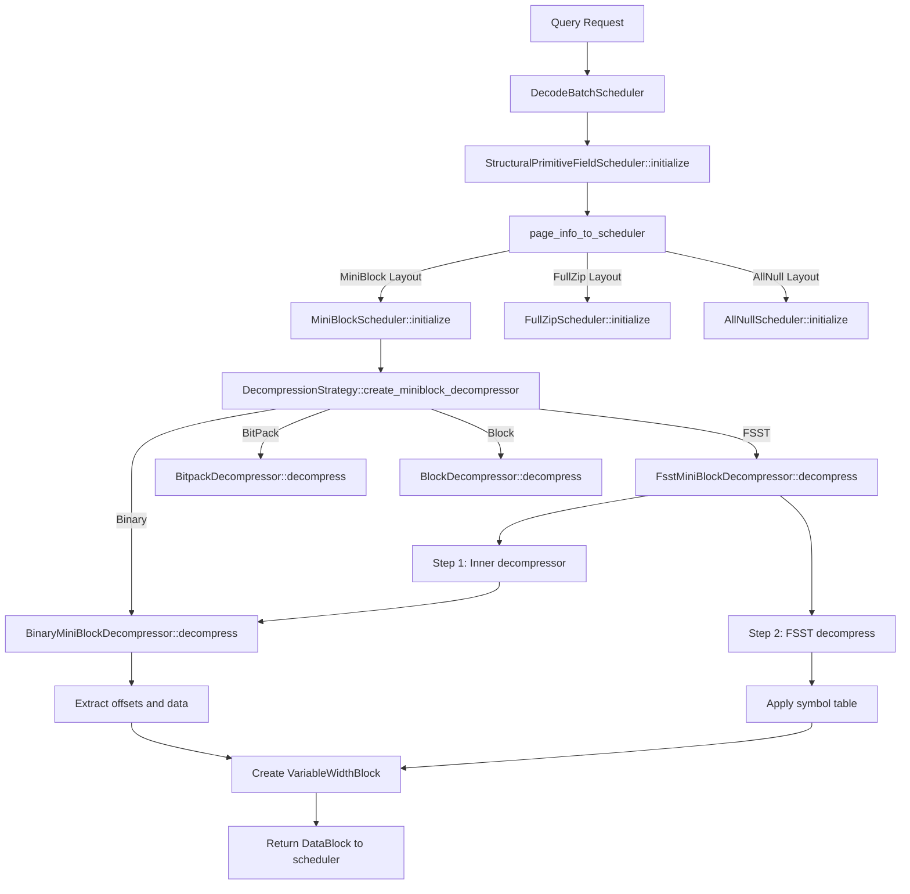

<!-- Generated by SpecStory, Markdown v2.1.0 -->

<!-- cursor Session a28ac317-c88b-4a3a-a2f1-110999ffa7da (2025-07-16 15:00Z) -->

# Identify decompress thread code path (2025-07-16 15:00Z)

_**User (2025-07-16 14:28Z)**_

Now is the decompress thread. Tell me the exact code path on where they happen. Be concise.


---

_**Agent (mode Agent)**_

I'll find the exact code path for the decompress thread in Lance.

---

<tool-use data-tool-type="search" data-tool-name="codebase_search">
<details>
                <summary>Tool use: **codebase_search** • Searched codebase "Where is the decompression thread implemented in Lance?" • **21** results</summary>
            
| File | Lines |
|------|-------|
| `tech/LanceDB/Lance2_1_largeBinary.md` | L56-94 |
| `tech/LanceDB/LanceInfo.md` | L260-325 |
| `tech/LanceDB/LanceInfo.md` | L65-102 |
| `tech/LanceDB/Lance2_1_largeBinary.md` | L1-56 |
| `tech/LanceDB/LanceInfo.md` | L209-260 |
| `tech/LanceDB/LanceInfo.md` | L374-419 |
| `tech/LanceDB/meeting.md` | L1-60 |
| `tech/LanceDB/Lance2_1_largeBinary.md` | L135-154 |
| `tech/LanceDB/Lance2_1_largeBinary.md` | L94-135 |
| `tech/LanceDB/LanceInfo.md` | L1-65 |
| `tech/LanceDB/LanceInfo.md` | L325-374 |
| `tech/LanceDB/LanceInfo.md` | L126-137 |
| `tech/LanceDB/LanceInfo.md` | L459-515 |
| `tech/LanceDB/LanceInfo.md` | L167-209 |
| `tech/LanceDB/LanceInfo.md` | L102-126 |
| `tech/DesigningData-IntensiveApplications.md` | L157-180 |
| `tech/LanceDB/LanceInfo.md` | L137-167 |
| `tech/Rust.md` | L401-451 |
| `tech/LanceDB/LanceInfo.md` | L419-459 |
| `tech/DesigningData-IntensiveApplications.md` | L103-131 |
| `tech/DesigningData-IntensiveApplications.md` | L131-157 |

</details>
</tool-use>

---

Let me search for more specific code paths related to decompression in Lance.

---

<tool-use data-tool-type="search" data-tool-name="grep_search">
<details>
            <summary>Tool use: **grep_search** • Grep search for "BinaryBlockDecompressor::decompress" • **0** files</summary>
        
No results found
</details>
</tool-use>

---

Let me try a broader search to find the decompression implementation.

---

<tool-use data-tool-type="search" data-tool-name="grep_search">
<details>
            <summary>Tool use: **grep_search** • Grep search for "decompress" • **10** files</summary>
        
| File | Line | Match |
|------|------|-------|
| `file:///Users/haochengliu/Documents/projects/lance/rust/lance-index/src/scalar/inverted/iter.rs` | L12 | `encoding::\{decompress_positions, decompress_posting_block, decompress_posting_remainder\},` |
| `file:///Users/haochengliu/Documents/projects/lance/rust/lance-index/src/scalar/inverted/iter.rs` | L119 | `let positions = decompress_positions(compressed.as_binary());` |
| `file:///Users/haochengliu/Documents/projects/lance/rust/lance-index/src/scalar/inverted/iter.rs` | L136 | `decompress_posting_remainder(` |
| `file:///Users/haochengliu/Documents/projects/lance/rust/lance-index/src/scalar/inverted/iter.rs` | L143 | `decompress_posting_block(compressed, &mut self.buffer, &mut doc_ids, &mut frequencies);` |
| `file:///Users/haochengliu/Documents/projects/lance/rust/lance-index/src/scalar/inverted/wand.rs` | L20 | `encoding::\{decompress_positions, decompress_posting_block, decompress_posting_remainder\},` |
| `file:///Users/haochengliu/Documents/projects/lance/rust/lance-index/src/scalar/inverted/wand.rs` | L62 | `fn decompress(&mut self, block: &[u8], block_idx: usize, num_blocks: usize, length: u32) \{` |
| `file:///Users/haochengliu/Documents/projects/lance/rust/lance-index/src/scalar/inverted/wand.rs` | L68 | `decompress_posting_remainder(block, remainder, &mut self.doc_ids, &mut self.freqs);` |
| `file:///Users/haochengliu/Documents/projects/lance/rust/lance-index/src/scalar/inverted/wand.rs` | L70 | `decompress_posting_block(block, &mut self.buffer, &mut self.doc_ids, &mut self.freqs);` |
| `file:///Users/haochengliu/Documents/projects/lance/rust/lance-index/src/scalar/inverted/wand.rs` | L177 | `compressed.decompress(block, block_idx, list.blocks.len(), list.length);` |
| `file:///Users/haochengliu/Documents/projects/lance/rust/lance-index/src/scalar/inverted/wand.rs` | L180 | `// Read from the decompressed block` |
| `file:///Users/haochengliu/Documents/projects/lance/rust/lance-index/src/scalar/inverted/wand.rs` | L195 | `let positions = decompress_positions(positions.as_binary());` |
| `file:///Users/haochengliu/Documents/projects/lance/rust/lance-index/src/scalar/inverted/index.rs` | L1996 | `use crate::scalar::inverted::encoding::decompress_posting_list;` |
| `file:///Users/haochengliu/Documents/projects/lance/rust/lance-index/src/scalar/inverted/index.rs` | L2020 | `let (doc_ids, freqs) = decompress_posting_list(` |
| `file:///Users/haochengliu/Documents/projects/lance/rust/lance-index/src/scalar/inverted/encoding.rs` | L154 | `/// decompress the posting list from a LargeBinaryArray` |
| `file:///Users/haochengliu/Documents/projects/lance/rust/lance-index/src/scalar/inverted/encoding.rs` | L157 | `pub fn decompress_posting_list(` |
| `file:///Users/haochengliu/Documents/projects/lance/rust/lance-index/src/scalar/inverted/encoding.rs` | L168 | `decompress_posting_block(compressed, &mut buffer, &mut doc_ids, &mut frequencies);` |
| `file:///Users/haochengliu/Documents/projects/lance/rust/lance-index/src/scalar/inverted/encoding.rs` | L174 | `decompress_posting_remainder(compressed, remainder, &mut doc_ids, &mut frequencies);` |
| `file:///Users/haochengliu/Documents/projects/lance/rust/lance-index/src/scalar/inverted/encoding.rs` | L180 | `pub fn decompress_positions(compressed: &arrow::array::LargeBinaryArray) -> Vec<u32> \{` |
| `file:///Users/haochengliu/Documents/projects/lance/rust/lance-index/src/scalar/inverted/encoding.rs` | L188 | `decompress_sorted_block(compressed, &mut buffer, &mut positions);` |
| `file:///Users/haochengliu/Documents/projects/lance/rust/lance-index/src/scalar/inverted/encoding.rs` | L194 | `decompress_remainder(compressed, remainder, &mut positions);` |
| `file:///Users/haochengliu/Documents/projects/lance/rust/lance-index/src/scalar/inverted/encoding.rs` | L200 | `// decompress the positions list from a ListArray of binary` |
| `file:///Users/haochengliu/Documents/projects/lance/rust/lance-index/src/scalar/inverted/encoding.rs` | L203 | `pub fn decompress_positions_list(compressed: &ListArray) -> Result<ListArray> \{` |
| `file:///Users/haochengliu/Documents/projects/lance/rust/lance-index/src/scalar/inverted/encoding.rs` | L208 | `let positions = decompress_positions(compressed);` |
| `file:///Users/haochengliu/Documents/projects/lance/rust/lance-index/src/scalar/inverted/encoding.rs` | L219 | `#[instrument(level = "info", name = "decompress_posting_block", skip_all)]` |
| `file:///Users/haochengliu/Documents/projects/lance/rust/lance-index/src/scalar/inverted/encoding.rs` | L220 | `pub fn decompress_posting_block(` |
| `file:///Users/haochengliu/Documents/projects/lance/rust/lance-index/src/scalar/inverted/encoding.rs` | L228 | `let num_bytes = decompress_sorted_block(block, buffer, doc_ids);` |
| `file:///Users/haochengliu/Documents/projects/lance/rust/lance-index/src/scalar/inverted/encoding.rs` | L229 | `decompress_block(&block[num_bytes..], buffer, frequencies);` |
| `file:///Users/haochengliu/Documents/projects/lance/rust/lance-index/src/scalar/inverted/encoding.rs` | L232 | `#[instrument(level = "info", name = "decompress_posting_remainder", skip_all)]` |
| `file:///Users/haochengliu/Documents/projects/lance/rust/lance-index/src/scalar/inverted/encoding.rs` | L233 | `pub fn decompress_posting_remainder(` |
| `file:///Users/haochengliu/Documents/projects/lance/rust/lance-index/src/scalar/inverted/encoding.rs` | L240 | `decompress_remainder(block, n, doc_ids);` |
| `file:///Users/haochengliu/Documents/projects/lance/rust/lance-index/src/scalar/inverted/encoding.rs` | L241 | `decompress_remainder(&block[n * 4..], n, frequencies);` |
| `file:///Users/haochengliu/Documents/projects/lance/rust/lance-index/src/scalar/inverted/encoding.rs` | L244 | `pub fn decompress_sorted_block(` |
| `file:///Users/haochengliu/Documents/projects/lance/rust/lance-index/src/scalar/inverted/encoding.rs` | L252 | `let num_bytes = compressor.decompress_sorted(initial, &block[5..], buffer, num_bits);` |
| `file:///Users/haochengliu/Documents/projects/lance/rust/lance-index/src/scalar/inverted/encoding.rs` | L257 | `fn decompress_block(block: &[u8], buffer: &mut [u32; BLOCK_SIZE], res: &mut Vec<u32>) \{` |
| `file:///Users/haochengliu/Documents/projects/lance/rust/lance-index/src/scalar/inverted/encoding.rs` | L260 | `compressor.decompress(&block[1..], buffer, num_bits);` |
| `file:///Users/haochengliu/Documents/projects/lance/rust/lance-index/src/scalar/inverted/encoding.rs` | L264 | `pub fn decompress_remainder(compressed: &[u8], n: usize, dest: &mut Vec<u32>) \{` |
| `file:///Users/haochengliu/Documents/projects/lance/rust/lance-index/src/scalar/inverted/encoding.rs` | L302 | `let (decompressed_doc_ids, decompressed_frequencies) =` |
| `file:///Users/haochengliu/Documents/projects/lance/rust/lance-index/src/scalar/inverted/encoding.rs` | L303 | `decompress_posting_list(num_rows as u32, &posting_list)?;` |
| `file:///Users/haochengliu/Documents/projects/lance/rust/lance-index/src/scalar/inverted/encoding.rs` | L304 | `assert_eq!(doc_ids, decompressed_doc_ids);` |
| `file:///Users/haochengliu/Documents/projects/lance/rust/lance-index/src/scalar/inverted/encoding.rs` | L305 | `assert_eq!(frequencies, decompressed_frequencies);` |
| `file:///Users/haochengliu/Documents/projects/lance/rust/lance-index/src/scalar/inverted/encoding.rs` | L328 | `let decompressed_positions = decompress_positions(&compressed);` |
| `file:///Users/haochengliu/Documents/projects/lance/rust/lance-index/src/scalar/inverted/encoding.rs` | L329 | `assert_eq!(positions, decompressed_positions);` |
| `file:///Users/haochengliu/Documents/projects/lance/rust/lance-encoding/src/v2/encodings/physical/fsst.rs` | L79 | `let mut decompressed_offsets = vec![0_i32; offsets.len()];` |
| `file:///Users/haochengliu/Documents/projects/lance/rust/lance-encoding/src/v2/encodings/physical/fsst.rs` | L80 | `let mut decompressed_bytes = vec![0_u8; bytes.len() * 8];` |
| `file:///Users/haochengliu/Documents/projects/lance/rust/lance-encoding/src/v2/encodings/physical/fsst.rs` | L83 | `decompressed_bytes.set_len(decompressed_bytes.capacity());` |
| `file:///Users/haochengliu/Documents/projects/lance/rust/lance-encoding/src/v2/encodings/physical/fsst.rs` | L85 | `fsst::fsst::decompress(` |
| `file:///Users/haochengliu/Documents/projects/lance/rust/lance-encoding/src/v2/encodings/physical/fsst.rs` | L89 | `&mut decompressed_bytes,` |
| `file:///Users/haochengliu/Documents/projects/lance/rust/lance-encoding/src/v2/encodings/physical/fsst.rs` | L90 | `&mut decompressed_offsets,` |
| `file:///Users/haochengliu/Documents/projects/lance/rust/lance-encoding/src/v2/encodings/physical/fsst.rs` | L96 | `let mut offsets_as_bytes_mut = Vec::with_capacity(decompressed_offsets.len());` |
| `file:///Users/haochengliu/Documents/projects/lance/rust/lance-encoding/src/v2/encodings/physical/fsst.rs` | L97 | `let decompressed_offsets = ScalarBuffer::<i32>::from(decompressed_offsets);` |
| `file:///Users/haochengliu/Documents/projects/lance/rust/lance-encoding/src/v2/encodings/physical/fsst.rs` | L98 | `offsets_as_bytes_mut.extend_from_slice(decompressed_offsets.inner().as_slice());` |
| `file:///Users/haochengliu/Documents/projects/lance/rust/lance-encoding/src/v2/encodings/physical/fsst.rs` | L100 | `let mut bytes_as_bytes_mut = Vec::with_capacity(decompressed_bytes.len());` |
| `file:///Users/haochengliu/Documents/projects/lance/rust/lance-encoding/src/v2/encodings/physical/fsst.rs` | L101 | `bytes_as_bytes_mut.extend_from_slice(&decompressed_bytes);` |
| `file:///Users/haochengliu/Documents/projects/lance/rust/lance-encoding/src/v2/encodings/physical/value.rs` | L131 | `fn decompress(&self) -> Result<Vec<Bytes>> \{` |
| `file:///Users/haochengliu/Documents/projects/lance/rust/lance-encoding/src/v2/encodings/physical/value.rs` | L136 | `buffer_compressor.decompress(&bytes_u8, &mut uncompressed_bytes)?;` |
| `file:///Users/haochengliu/Documents/projects/lance/rust/lance-encoding/src/v2/encodings/physical/value.rs` | L151 | `*uncompressed_bytes = Some(self.decompress()?);` |
| `file:///Users/haochengliu/Documents/projects/lance/rust/lance-encoding/src/v2/encodings/physical/bitpack.rs` | L444 | `let decompressed_output = bitpacked_for_non_neg_decode(` |
| `file:///Users/haochengliu/Documents/projects/lance/rust/lance-encoding/src/v2/encodings/physical/bitpack.rs` | L453 | `decompressed_buf: decompressed_output,` |
| `file:///Users/haochengliu/Documents/projects/lance/rust/lance-encoding/src/v2/encodings/physical/bitpack.rs` | L465 | `decompressed_buf: LanceBuffer,` |
| `file:///Users/haochengliu/Documents/projects/lance/rust/lance-encoding/src/v2/encodings/physical/bitpack.rs` | L480 | `data: self.decompressed_buf.slice_with_length(` |
| `file:///Users/haochengliu/Documents/projects/lance/rust/lance-encoding/src/v2/encodings/physical/bitpack.rs` | L493 | `let mut decompressed: Vec<$uncompressed_type> = Vec::with_capacity($num_rows as usize);` |
| `file:///Users/haochengliu/Documents/projects/lance/rust/lance-encoding/src/v2/encodings/physical/bitpack.rs` | L495 | `let mut decompress_chunk_buf = vec![0 as $uncompressed_type; ELEMS_PER_CHUNK as usize];` |
| `file:///Users/haochengliu/Documents/projects/lance/rust/lance-encoding/src/v2/encodings/physical/bitpack.rs` | L514 | `&mut decompress_chunk_buf,` |
| `file:///Users/haochengliu/Documents/projects/lance/rust/lance-encoding/src/v2/encodings/physical/bitpack.rs` | L525 | `decompressed.extend_from_slice(` |
| `file:///Users/haochengliu/Documents/projects/lance/rust/lance-encoding/src/v2/encodings/physical/bitpack.rs` | L526 | `&decompress_chunk_buf[(curr_range_start % ELEMS_PER_CHUNK) as usize..],` |
| `file:///Users/haochengliu/Documents/projects/lance/rust/lance-encoding/src/v2/encodings/physical/bitpack.rs` | L535 | `decompressed.extend_from_slice(` |
| `file:///Users/haochengliu/Documents/projects/lance/rust/lance-encoding/src/v2/encodings/physical/bitpack.rs` | L536 | `&decompress_chunk_buf[(curr_range_start % ELEMS_PER_CHUNK) as usize..]` |
| `file:///Users/haochengliu/Documents/projects/lance/rust/lance-encoding/src/v2/encodings/physical/bitpack.rs` | L555 | `LanceBuffer::reinterpret_vec(decompressed)` |
| `file:///Users/haochengliu/Documents/projects/lance/rust/lance-encoding/src/decoder.rs` | L201 | `//! arrays.  This may involve signifciant CPU processing like decompression or arithmetic in order` |
| `file:///Users/haochengliu/Documents/projects/lance/rust/lance-encoding/src/decoder.rs` | L237 | `use crate::compression::\{DecompressionStrategy, DefaultDecompressionStrategy\};` |
| `file:///Users/haochengliu/Documents/projects/lance/rust/lance-encoding/src/decoder.rs` | L475 | `pub decompressor_strategy: Arc<dyn DecompressionStrategy>,` |
| `file:///Users/haochengliu/Documents/projects/lance/rust/lance-encoding/src/decoder.rs` | L482 | `decompressor_strategy: Arc::new(DefaultDecompressionStrategy \{}),` |
| `file:///Users/haochengliu/Documents/projects/lance/rust/lance-encoding/src/decoder.rs` | L662 | `self.decompressor_strategy.as_ref(),` |
| `file:///Users/haochengliu/Documents/projects/lance/rust/lance-encoding/src/decoder.rs` | L676 | `self.decompressor_strategy.as_ref(),` |
| `file:///Users/haochengliu/Documents/projects/lance/rust/lance-encoding/src/decoder.rs` | L701 | `self.decompressor_strategy.as_ref(),` |
| `file:///Users/haochengliu/Documents/projects/lance/rust/lance-encoding/src/decoder.rs` | L2020 | `/// such as decompressing from some compressed representation.` |
| `file:///Users/haochengliu/Documents/projects/lance/rust/lance-encoding/src/compression.rs` | L14 | `//! amplification and decompress entire blocks we are able to use opaque compression.` |
| `file:///Users/haochengliu/Documents/projects/lance/rust/lance-encoding/src/compression.rs` | L26 | `BinaryBlockDecompressor, BinaryMiniBlockDecompressor, BinaryMiniBlockEncoder,` |
| `file:///Users/haochengliu/Documents/projects/lance/rust/lance-encoding/src/compression.rs` | L31 | `constant::ConstantDecompressor,` |
| `file:///Users/haochengliu/Documents/projects/lance/rust/lance-encoding/src/compression.rs` | L33 | `FsstMiniBlockDecompressor, FsstMiniBlockEncoder, FsstPerValueDecompressor,` |
| `file:///Users/haochengliu/Documents/projects/lance/rust/lance-encoding/src/compression.rs` | L37 | `PackedStructFixedWidthMiniBlockDecompressor, PackedStructFixedWidthMiniBlockEncoder,` |
| `file:///Users/haochengliu/Documents/projects/lance/rust/lance-encoding/src/compression.rs` | L39 | `value::\{ValueDecompressor, ValueEncoder\},` |
| `file:///Users/haochengliu/Documents/projects/lance/rust/lance-encoding/src/compression.rs` | L60 | `/// of compression it is assumed that the entire block of data will be present at decompression.` |
| `file:///Users/haochengliu/Documents/projects/lance/rust/lance-encoding/src/compression.rs` | L69 | `/// Also returns a description of the compression that can be used to decompress` |
| `file:///Users/haochengliu/Documents/projects/lance/rust/lance-encoding/src/compression.rs` | L81 | `///   In addition, each value should be independently decompressible.` |
| `file:///Users/haochengliu/Documents/projects/lance/rust/lance-encoding/src/compression.rs` | L272 | `pub trait MiniBlockDecompressor: std::fmt::Debug + Send + Sync \{` |
| `file:///Users/haochengliu/Documents/projects/lance/rust/lance-encoding/src/encodings/logical/primitive.rs` | L36 | `BlockDecompressor, CompressionStrategy, DecompressionStrategy, MiniBlockDecompressor,` |
| `file:///Users/haochengliu/Documents/projects/lance/rust/lance-encoding/src/encodings/logical/primitive.rs` | L42 | `compression::\{FixedPerValueDecompressor, VariablePerValueDecompressor\},` |
| `file:///Users/haochengliu/Documents/projects/lance/rust/lance-encoding/src/encodings/logical/primitive.rs` | L109 | `/// A mini-block chunk that has been decoded and decompressed` |
| `file:///Users/haochengliu/Documents/projects/lance/rust/lance-encoding/src/encodings/logical/primitive.rs` | L126 | `rep_decompressor: Option<Arc<dyn BlockDecompressor>>,` |
| `file:///Users/haochengliu/Documents/projects/lance/rust/lance-encoding/src/encodings/logical/primitive.rs` | L127 | `def_decompressor: Option<Arc<dyn BlockDecompressor>>,` |
| `file:///Users/haochengliu/Documents/projects/lance/rust/lance-encoding/src/encodings/logical/primitive.rs` | L128 | `value_decompressor: Arc<dyn MiniBlockDecompressor>,` |
| `file:///Users/haochengliu/Documents/projects/lance/rust/lance-encoding/src/encodings/logical/primitive.rs` | L138 | `rep_decompressor: &dyn BlockDecompressor,` |
| `file:///Users/haochengliu/Documents/projects/lance/rust/lance-encoding/src/encodings/logical/primitive.rs` | L142 | `let rep = rep_decompressor.decompress(levels, num_levels as u64)?;` |
| `file:///Users/haochengliu/Documents/projects/lance/rust/lance-encoding/src/encodings/logical/primitive.rs` | L414 | `let rep_size = if self.rep_decompressor.is_some() \{` |
| `file:///Users/haochengliu/Documents/projects/lance/rust/lance-encoding/src/encodings/logical/primitive.rs` | L421 | `let def_size = if self.def_decompressor.is_some() \{` |
| `file:///Users/haochengliu/Documents/projects/lance/rust/lance-encoding/src/encodings/logical/primitive.rs` | L463 | `.value_decompressor` |
| `file:///Users/haochengliu/Documents/projects/lance/rust/lance-encoding/src/encodings/logical/primitive.rs` | L464 | `.decompress(buffers, items_in_chunk)?;` |
| `file:///Users/haochengliu/Documents/projects/lance/rust/lance-encoding/src/encodings/logical/primitive.rs` | L469 | `self.rep_decompressor.as_ref().unwrap().as_ref(),` |
| `file:///Users/haochengliu/Documents/projects/lance/rust/lance-encoding/src/encodings/logical/primitive.rs` | L478 | `self.def_decompressor.as_ref().unwrap().as_ref(),` |
| `file:///Users/haochengliu/Documents/projects/lance/rust/lance-encoding/src/encodings/logical/primitive.rs` | L623 | `rep_decompressor: Option<Arc<dyn BlockDecompressor>>,` |
| `file:///Users/haochengliu/Documents/projects/lance/rust/lance-encoding/src/encodings/logical/primitive.rs` | L624 | `def_decompressor: Option<Arc<dyn BlockDecompressor>>,` |
| `file:///Users/haochengliu/Documents/projects/lance/rust/lance-encoding/src/encodings/logical/primitive.rs` | L625 | `value_decompressor: Arc<dyn MiniBlockDecompressor>,` |
| `file:///Users/haochengliu/Documents/projects/lance/rust/lance-encoding/src/encodings/logical/primitive.rs` | L673 | `def_decompressor: self.def_decompressor.clone(),` |
| `file:///Users/haochengliu/Documents/projects/lance/rust/lance-encoding/src/encodings/logical/primitive.rs` | L674 | `rep_decompressor: self.rep_decompressor.clone(),` |
| `file:///Users/haochengliu/Documents/projects/lance/rust/lance-encoding/src/encodings/logical/primitive.rs` | L675 | `value_decompressor: self.value_decompressor.clone(),` |
| `file:///Users/haochengliu/Documents/projects/lance/rust/lance-encoding/src/encodings/logical/primitive.rs` | L976 | `dictionary_decompressor: Arc<dyn BlockDecompressor>,` |
| `file:///Users/haochengliu/Documents/projects/lance/rust/lance-encoding/src/encodings/logical/primitive.rs` | L1109 | `rep_decompressor: Option<Arc<dyn BlockDecompressor>>,` |
| `file:///Users/haochengliu/Documents/projects/lance/rust/lance-encoding/src/encodings/logical/primitive.rs` | L1110 | `def_decompressor: Option<Arc<dyn BlockDecompressor>>,` |
| `file:///Users/haochengliu/Documents/projects/lance/rust/lance-encoding/src/encodings/logical/primitive.rs` | L1111 | `value_decompressor: Arc<dyn MiniBlockDecompressor>,` |
| `file:///Users/haochengliu/Documents/projects/lance/rust/lance-encoding/src/encodings/logical/primitive.rs` | L1124 | `decompressors: &dyn DecompressionStrategy,` |
| `file:///Users/haochengliu/Documents/projects/lance/rust/lance-encoding/src/encodings/logical/primitive.rs` | L1126 | `let rep_decompressor = layout` |
| `file:///Users/haochengliu/Documents/projects/lance/rust/lance-encoding/src/encodings/logical/primitive.rs` | L1130 | `decompressors` |
| `file:///Users/haochengliu/Documents/projects/lance/rust/lance-encoding/src/encodings/logical/primitive.rs` | L1131 | `.create_block_decompressor(rep_compression)` |
| `file:///Users/haochengliu/Documents/projects/lance/rust/lance-encoding/src/encodings/logical/primitive.rs` | L1135 | `let def_decompressor = layout` |
| `file:///Users/haochengliu/Documents/projects/lance/rust/lance-encoding/src/encodings/logical/primitive.rs` | L1139 | `decompressors` |
| `file:///Users/haochengliu/Documents/projects/lance/rust/lance-encoding/src/encodings/logical/primitive.rs` | L1140 | `.create_block_decompressor(def_compression)` |
| `file:///Users/haochengliu/Documents/projects/lance/rust/lance-encoding/src/encodings/logical/primitive.rs` | L1149 | `let value_decompressor = decompressors.create_miniblock_decompressor(` |
| `file:///Users/haochengliu/Documents/projects/lance/rust/lance-encoding/src/encodings/logical/primitive.rs` | L1151 | `decompressors,` |
| `file:///Users/haochengliu/Documents/projects/lance/rust/lance-encoding/src/encodings/logical/primitive.rs` | L1159 | `dictionary_decompressor: decompressors` |
| `file:///Users/haochengliu/Documents/projects/lance/rust/lance-encoding/src/encodings/logical/primitive.rs` | L1160 | `.create_block_decompressor(dictionary_encoding)?` |
| `file:///Users/haochengliu/Documents/projects/lance/rust/lance-encoding/src/encodings/logical/primitive.rs` | L1168 | `dictionary_decompressor: decompressors` |
| `file:///Users/haochengliu/Documents/projects/lance/rust/lance-encoding/src/encodings/logical/primitive.rs` | L1169 | `.create_block_decompressor(dictionary_encoding)?` |
| `file:///Users/haochengliu/Documents/projects/lance/rust/lance-encoding/src/encodings/logical/primitive.rs` | L1185 | `rep_decompressor,` |
| `file:///Users/haochengliu/Documents/projects/lance/rust/lance-encoding/src/encodings/logical/primitive.rs` | L1186 | `def_decompressor,` |
| `file:///Users/haochengliu/Documents/projects/lance/rust/lance-encoding/src/encodings/logical/primitive.rs` | L1187 | `value_decompressor: value_decompressor.into(),` |
| `file:///Users/haochengliu/Documents/projects/lance/rust/lance-encoding/src/encodings/logical/primitive.rs` | L1549 | `Some(Arc::new(dictionary.dictionary_decompressor.decompress(` |
| `file:///Users/haochengliu/Documents/projects/lance/rust/lance-encoding/src/encodings/logical/primitive.rs` | L1612 | `let rep_decompressor = self.rep_decompressor.clone();` |
| `file:///Users/haochengliu/Documents/projects/lance/rust/lance-encoding/src/encodings/logical/primitive.rs` | L1613 | `let def_decompressor = self.def_decompressor.clone();` |
| `file:///Users/haochengliu/Documents/projects/lance/rust/lance-encoding/src/encodings/logical/primitive.rs` | L1614 | `let value_decompressor = self.value_decompressor.clone();` |
| `file:///Users/haochengliu/Documents/projects/lance/rust/lance-encoding/src/encodings/logical/primitive.rs` | L1629 | `rep_decompressor,` |
| `file:///Users/haochengliu/Documents/projects/lance/rust/lance-encoding/src/encodings/logical/primitive.rs` | L1630 | `def_decompressor,` |
| `file:///Users/haochengliu/Documents/projects/lance/rust/lance-encoding/src/encodings/logical/primitive.rs` | L1631 | `value_decompressor,` |
| `file:///Users/haochengliu/Documents/projects/lance/rust/lance-encoding/src/encodings/logical/primitive.rs` | L1653 | `enum PerValueDecompressor \{` |
| `file:///Users/haochengliu/Documents/projects/lance/rust/lance-encoding/src/encodings/logical/primitive.rs` | L1654 | `Fixed(Arc<dyn FixedPerValueDecompressor>),` |
| `file:///Users/haochengliu/Documents/projects/lance/rust/lance-encoding/src/encodings/logical/primitive.rs` | L1655 | `Variable(Arc<dyn VariablePerValueDecompressor>),` |
| `file:///Users/haochengliu/Documents/projects/lance/rust/lance-encoding/src/encodings/logical/primitive.rs` | L1660 | `value_decompressor: PerValueDecompressor,` |
| `file:///Users/haochengliu/Documents/projects/lance/rust/lance-encoding/src/encodings/logical/primitive.rs` | L1690 | `decompressors: &dyn DecompressionStrategy,` |
| `file:///Users/haochengliu/Documents/projects/lance/rust/lance-encoding/src/encodings/logical/primitive.rs` | L1712 | `let value_decompressor = match layout.details \{` |
| `file:///Users/haochengliu/Documents/projects/lance/rust/lance-encoding/src/encodings/logical/primitive.rs` | L1714 | `let decompressor = decompressors.create_fixed_per_value_decompressor(` |
| `file:///Users/haochengliu/Documents/projects/lance/rust/lance-encoding/src/encodings/logical/primitive.rs` | L1717 | `PerValueDecompressor::Fixed(decompressor.into())` |
| `file:///Users/haochengliu/Documents/projects/lance/rust/lance-encoding/src/encodings/logical/primitive.rs` | L1720 | `let decompressor = decompressors.create_variable_per_value_decompressor(` |
| `file:///Users/haochengliu/Documents/projects/lance/rust/lance-encoding/src/encodings/logical/primitive.rs` | L1723 | `PerValueDecompressor::Variable(decompressor.into())` |
| `file:///Users/haochengliu/Documents/projects/lance/rust/lance-encoding/src/encodings/logical/primitive.rs` | L1755 | `value_decompressor,` |
| `file:///Users/haochengliu/Documents/projects/lance/rust/lance-encoding/src/encodings/logical/primitive.rs` | L1813 | `match &details.value_decompressor \{` |
| `file:///Users/haochengliu/Documents/projects/lance/rust/lance-encoding/src/encodings/logical/primitive.rs` | L1814 | `PerValueDecompressor::Fixed(decompressor) => \{` |
| `file:///Users/haochengliu/Documents/projects/lance/rust/lance-encoding/src/encodings/logical/primitive.rs` | L1815 | `let bits_per_value = decompressor.bits_per_value();` |
| `file:///Users/haochengliu/Documents/projects/lance/rust/lance-encoding/src/encodings/logical/primitive.rs` | L1834 | `PerValueDecompressor::Variable(_decompressor) => \{` |

</details>
</tool-use>

---

Let me search more specifically for the BinaryBlockDecompressor in the physical directory:

---

<tool-use data-tool-type="search" data-tool-name="grep_search">
<details>
            <summary>Tool use: **grep_search** • Grep search for "BinaryBlockDecompressor" • **1** files</summary>
        
| File | Line | Match |
|------|------|-------|
| `file:///Users/haochengliu/Documents/projects/lance/rust/lance-encoding/src/encodings/physical/binary.rs` | L311 | `/// It's used in VariableEncoder and BinaryBlockDecompressor` |
| `file:///Users/haochengliu/Documents/projects/lance/rust/lance-encoding/src/encodings/physical/binary.rs` | L417 | `pub struct BinaryBlockDecompressor \{}` |
| `file:///Users/haochengliu/Documents/projects/lance/rust/lance-encoding/src/encodings/physical/binary.rs` | L419 | `impl BlockDecompressor for BinaryBlockDecompressor \{` |

</details>
</tool-use>

---

Now let me look at the implementation of the BinaryBlockDecompressor:

---

<tool-use data-tool-type="read" data-tool-name="read_file">
<details><summary>Tool use: **read_file** • Read file: rust/lance-encoding/src/encodings/physical/binary.rs</summary>

</details>
</tool-use>

---

Let me also look at the FSST decompressor implementation:

---

<tool-use data-tool-type="read" data-tool-name="read_file">
<details><summary>Tool use: **read_file** • Read file: rust/lance-encoding/src/encodings/physical/fsst.rs</summary>

</details>
</tool-use>

---

Let me check the FsstMiniBlockDecompressor implementation:

---

<tool-use data-tool-type="read" data-tool-name="read_file">
<details><summary>Tool use: **read_file** • Read file: rust/lance-encoding/src/encodings/physical/fsst.rs</summary>

</details>
</tool-use>

---

Based on my analysis of the code, I can now provide the exact code path for the decompress thread in Lance:

## Decompress Thread Code Path in Lance

### Main Decompression Flow:

1. **Entry Point**: `MiniBlockScheduler::initialize` in `logical/primitive.rs:1526`
   - Initiates the decompression process when data is requested

2. **Scheduler Selection**: `page_info_to_scheduler` in `logical/primitive.rs:2636-2676`
   - Selects appropriate scheduler based on encoding type (MiniBlock, FullZip, Dictionary, AllNull)

3. **Decompressor Creation**: `DecompressionStrategy::create_miniblock_decompressor` 
   - Creates the appropriate decompressor based on compression type

### Binary Data Decompression:

1. **Binary Block Decompression**: `BinaryBlockDecompressor::decompress` in `physical/binary.rs:420-477`
   - Handles decompression of binary data blocks
   - Extracts offsets and data from compressed buffer
   - Supports both 32-bit and 64-bit offsets

2. **Binary MiniBlock Decompression**: `BinaryMiniBlockDecompressor::decompress` in `physical/binary.rs:243`
   - Decompresses data in 4KB chunks for efficient random access

### FSST Decompression (for strings/binary data):

1. **FSST MiniBlock Decompression**: `FsstMiniBlockDecompressor::decompress` in `physical/fsst.rs:299-347`
   - Two-step process:
     1. First calls inner decompressor (typically BinaryMiniBlockDecompressor)
     2. Then performs FSST decompression using the symbol table
   - Handles both 32-bit and 64-bit offsets

2. **FSST Symbol Table Usage**: `fsst::fsst::decompress` in `physical/fsst.rs:317-323`
   - Uses the FSST symbol table to expand compressed bytes back to original form

This multi-layered decompression approach allows Lance to efficiently handle different data types and compression strategies while maintaining fast random access capabilities.

---

<tool-use data-tool-type="generic" data-tool-name="create_diagram">
<details><summary>Tool use: **create_diagram**</summary>


</details>
</tool-use>

---

## Decompress Thread Code Path in Lance

The diagram shows the exact code path for decompression in Lance. The process follows these key steps:

1. **Query Initiation**: Starts with `DecodeBatchScheduler` in `decoder.rs:948`

2. **Strategy Selection**: `StructuralPrimitiveFieldScheduler::initialize` in `logical/primitive.rs:2716` determines the appropriate strategy based on metadata

3. **Page Layout Detection**: `page_info_to_scheduler` in `logical/primitive.rs:2636-2676` selects between MiniBlock, FullZip, or AllNull layouts

4. **Decompressor Creation**: Based on compression type (FSST, Binary, BitPack, etc.), the appropriate decompressor is created

5. **Decompression Execution**:
   - For FSST compressed data: `FsstMiniBlockDecompressor::decompress` in `physical/fsst.rs:299-347`
   - For binary data: `BinaryBlockDecompressor::decompress` in `physical/binary.rs:420-477`
   - For miniblock binary data: `BinaryMiniBlockDecompressor::decompress` in `physical/binary.rs:243`

6. **Multi-stage Decompression**: FSST decompression uses a two-stage process:
   - First calls the inner decompressor (typically Binary)
   - Then applies FSST symbol table to expand compressed bytes

7. **Final Data Creation**: The decompressed data is assembled into a `VariableWidthBlock` and returned as a `DataBlock`

The decompression is designed to efficiently handle different data types and compression strategies while maintaining fast random access capabilities through the miniblock approach.

---

_**User (2025-07-16 14:28Z)**_

In my image, there is things  like physical  data blocks.  Can you point me to where the corresponding code are? be concise

---

_**Agent (mode Agent)**_

Let me find the code related to physical data blocks in Lance.

---

<tool-use data-tool-type="search" data-tool-name="grep_search">
<details>
            <summary>Tool use: **grep_search** • Grep search for "PhysicalDataBlock" • **0** files</summary>
        
No results found
</details>
</tool-use>

---

Let me try a broader search:

---

<tool-use data-tool-type="search" data-tool-name="grep_search">
<details>
            <summary>Tool use: **grep_search** • Grep search for "DataBlock" • **6** files</summary>
        
| File | Line | Match |
|------|------|-------|
| `file:///Users/haochengliu/Documents/projects/lance/rust/lance-encoding/src/statistics.rs` | L16 | `AllNullDataBlock, DataBlock, DictionaryDataBlock, FixedSizeListBlock, FixedWidthDataBlock,` |
| `file:///Users/haochengliu/Documents/projects/lance/rust/lance-encoding/src/statistics.rs` | L17 | `NullableDataBlock, OpaqueBlock, StructDataBlock, VariableWidthBlock,` |
| `file:///Users/haochengliu/Documents/projects/lance/rust/lance-encoding/src/statistics.rs` | L53 | `impl ComputeStat for DataBlock \{` |
| `file:///Users/haochengliu/Documents/projects/lance/rust/lance-encoding/src/statistics.rs` | L73 | `panic!("compute_stat should only be called once during DataBlock construction");` |
| `file:///Users/haochengliu/Documents/projects/lance/rust/lance-encoding/src/statistics.rs` | L89 | `impl ComputeStat for FixedWidthDataBlock \{` |
| `file:///Users/haochengliu/Documents/projects/lance/rust/lance-encoding/src/statistics.rs` | L91 | `// compute this datablock's data_size` |
| `file:///Users/haochengliu/Documents/projects/lance/rust/lance-encoding/src/statistics.rs` | L95 | `// compute this datablock's max_bit_width` |
| `file:///Users/haochengliu/Documents/projects/lance/rust/lance-encoding/src/statistics.rs` | L98 | `// the MaxLength of FixedWidthDataBlock is it's self.bits_per_value / 8` |
| `file:///Users/haochengliu/Documents/projects/lance/rust/lance-encoding/src/statistics.rs` | L133 | `// compute this datablock's data_size` |
| `file:///Users/haochengliu/Documents/projects/lance/rust/lance-encoding/src/statistics.rs` | L146 | `.unwrap_or_else(\|\| panic!("\{:?\} DataBlock does not have `\{}` statistics.", self, stat))` |
| `file:///Users/haochengliu/Documents/projects/lance/rust/lance-encoding/src/statistics.rs` | L154 | `"\{:?\} DataBlock does not have exactly one value for `\{} statistics.",` |
| `file:///Users/haochengliu/Documents/projects/lance/rust/lance-encoding/src/statistics.rs` | L162 | `impl GetStat for DataBlock \{` |
| `file:///Users/haochengliu/Documents/projects/lance/rust/lance-encoding/src/statistics.rs` | L179 | `// NullableDataBlock will be deprecated in Lance 2.1.` |
| `file:///Users/haochengliu/Documents/projects/lance/rust/lance-encoding/src/statistics.rs` | L180 | `impl GetStat for NullableDataBlock \{` |
| `file:///Users/haochengliu/Documents/projects/lance/rust/lance-encoding/src/statistics.rs` | L181 | `// This function simply returns the statistics of the inner `DataBlock` of `NullableDataBlock`,` |
| `file:///Users/haochengliu/Documents/projects/lance/rust/lance-encoding/src/statistics.rs` | L182 | `// this is not accurate but `NullableDataBlock` is going to be deprecated in Lance 2.1 anyway.` |
| `file:///Users/haochengliu/Documents/projects/lance/rust/lance-encoding/src/statistics.rs` | L293 | `impl GetStat for AllNullDataBlock \{` |
| `file:///Users/haochengliu/Documents/projects/lance/rust/lance-encoding/src/statistics.rs` | L306 | `impl GetStat for FixedWidthDataBlock \{` |
| `file:///Users/haochengliu/Documents/projects/lance/rust/lance-encoding/src/statistics.rs` | L317 | `impl FixedWidthDataBlock \{` |
| `file:///Users/haochengliu/Documents/projects/lance/rust/lance-encoding/src/statistics.rs` | L401 | `impl GetStat for DictionaryDataBlock \{` |
| `file:///Users/haochengliu/Documents/projects/lance/rust/lance-encoding/src/statistics.rs` | L407 | `impl GetStat for StructDataBlock \{` |
| `file:///Users/haochengliu/Documents/projects/lance/rust/lance-encoding/src/statistics.rs` | L417 | `impl ComputeStat for StructDataBlock \{` |
| `file:///Users/haochengliu/Documents/projects/lance/rust/lance-encoding/src/statistics.rs` | L450 | `use super::DataBlock;` |
| `file:///Users/haochengliu/Documents/projects/lance/rust/lance-encoding/src/statistics.rs` | L465 | `let block = DataBlock::from_arrays(&[arr1.clone(), arr2.clone(), arr3.clone()], 9);` |
| `file:///Users/haochengliu/Documents/projects/lance/rust/lance-encoding/src/statistics.rs` | L487 | `let block = DataBlock::from_array(arr.clone());` |
| `file:///Users/haochengliu/Documents/projects/lance/rust/lance-encoding/src/statistics.rs` | L507 | `let block = DataBlock::from_array(arr.clone());` |
| `file:///Users/haochengliu/Documents/projects/lance/rust/lance-encoding/src/statistics.rs` | L528 | `let block = DataBlock::from_array(arr.clone());` |
| `file:///Users/haochengliu/Documents/projects/lance/rust/lance-encoding/src/statistics.rs` | L533 | `let block = DataBlock::from_array(arr.clone());` |
| `file:///Users/haochengliu/Documents/projects/lance/rust/lance-encoding/src/statistics.rs` | L549 | `let block = DataBlock::from_array(array_ref);` |
| `file:///Users/haochengliu/Documents/projects/lance/rust/lance-encoding/src/statistics.rs` | L558 | `let block = DataBlock::from_array(array_ref);` |
| `file:///Users/haochengliu/Documents/projects/lance/rust/lance-encoding/src/statistics.rs` | L566 | `let block = DataBlock::from_array(array_ref);` |
| `file:///Users/haochengliu/Documents/projects/lance/rust/lance-encoding/src/statistics.rs` | L574 | `let block = DataBlock::from_array(array_ref);` |
| `file:///Users/haochengliu/Documents/projects/lance/rust/lance-encoding/src/statistics.rs` | L582 | `let block = DataBlock::from_array(array_ref);` |
| `file:///Users/haochengliu/Documents/projects/lance/rust/lance-encoding/src/statistics.rs` | L590 | `let block = DataBlock::from_array(array_ref);` |
| `file:///Users/haochengliu/Documents/projects/lance/rust/lance-encoding/src/statistics.rs` | L598 | `let block = DataBlock::from_array(array_ref);` |
| `file:///Users/haochengliu/Documents/projects/lance/rust/lance-encoding/src/statistics.rs` | L606 | `let block = DataBlock::from_array(array_ref);` |
| `file:///Users/haochengliu/Documents/projects/lance/rust/lance-encoding/src/statistics.rs` | L614 | `let block = DataBlock::from_array(array_ref);` |
| `file:///Users/haochengliu/Documents/projects/lance/rust/lance-encoding/src/statistics.rs` | L622 | `let block = DataBlock::from_array(array_ref);` |
| `file:///Users/haochengliu/Documents/projects/lance/rust/lance-encoding/src/statistics.rs` | L630 | `let block = DataBlock::from_array(array_ref);` |
| `file:///Users/haochengliu/Documents/projects/lance/rust/lance-encoding/src/statistics.rs` | L638 | `let block = DataBlock::from_array(array_ref);` |
| `file:///Users/haochengliu/Documents/projects/lance/rust/lance-encoding/src/statistics.rs` | L646 | `let block = DataBlock::from_array(array_ref);` |
| `file:///Users/haochengliu/Documents/projects/lance/rust/lance-encoding/src/statistics.rs` | L654 | `let block = DataBlock::from_array(array_ref);` |
| `file:///Users/haochengliu/Documents/projects/lance/rust/lance-encoding/src/statistics.rs` | L662 | `let block = DataBlock::from_array(array_ref);` |
| `file:///Users/haochengliu/Documents/projects/lance/rust/lance-encoding/src/statistics.rs` | L670 | `let block = DataBlock::from_array(array_ref);` |
| `file:///Users/haochengliu/Documents/projects/lance/rust/lance-encoding/src/statistics.rs` | L678 | `let block = DataBlock::from_array(array_ref);` |
| `file:///Users/haochengliu/Documents/projects/lance/rust/lance-encoding/src/statistics.rs` | L686 | `let block = DataBlock::from_array(array_ref);` |
| `file:///Users/haochengliu/Documents/projects/lance/rust/lance-encoding/src/statistics.rs` | L694 | `let block = DataBlock::from_array(array_ref);` |
| `file:///Users/haochengliu/Documents/projects/lance/rust/lance-encoding/src/statistics.rs` | L702 | `let block = DataBlock::from_array(array_ref);` |
| `file:///Users/haochengliu/Documents/projects/lance/rust/lance-encoding/src/statistics.rs` | L710 | `let block = DataBlock::from_array(array_ref);` |
| `file:///Users/haochengliu/Documents/projects/lance/rust/lance-encoding/src/statistics.rs` | L718 | `let block = DataBlock::from_array(array_ref);` |
| `file:///Users/haochengliu/Documents/projects/lance/rust/lance-encoding/src/statistics.rs` | L726 | `let block = DataBlock::from_array(array_ref);` |
| `file:///Users/haochengliu/Documents/projects/lance/rust/lance-encoding/src/statistics.rs` | L734 | `let block = DataBlock::from_array(array_ref);` |
| `file:///Users/haochengliu/Documents/projects/lance/rust/lance-encoding/src/statistics.rs` | L742 | `let block = DataBlock::from_array(array_ref);` |
| `file:///Users/haochengliu/Documents/projects/lance/rust/lance-encoding/src/statistics.rs` | L750 | `let block = DataBlock::from_array(array_ref);` |
| `file:///Users/haochengliu/Documents/projects/lance/rust/lance-encoding/src/statistics.rs` | L758 | `let block = DataBlock::from_array(array_ref);` |
| `file:///Users/haochengliu/Documents/projects/lance/rust/lance-encoding/src/statistics.rs` | L766 | `let block = DataBlock::from_array(array_ref);` |
| `file:///Users/haochengliu/Documents/projects/lance/rust/lance-encoding/src/statistics.rs` | L774 | `let block = DataBlock::from_array(array_ref);` |
| `file:///Users/haochengliu/Documents/projects/lance/rust/lance-encoding/src/statistics.rs` | L782 | `let block = DataBlock::from_array(array_ref);` |
| `file:///Users/haochengliu/Documents/projects/lance/rust/lance-encoding/src/statistics.rs` | L790 | `let block = DataBlock::from_array(array_ref);` |
| `file:///Users/haochengliu/Documents/projects/lance/rust/lance-encoding/src/statistics.rs` | L798 | `let block = DataBlock::from_array(array_ref);` |
| `file:///Users/haochengliu/Documents/projects/lance/rust/lance-encoding/src/statistics.rs` | L806 | `let block = DataBlock::from_array(array_ref);` |
| `file:///Users/haochengliu/Documents/projects/lance/rust/lance-encoding/src/statistics.rs` | L814 | `let block = DataBlock::from_array(array_ref);` |
| `file:///Users/haochengliu/Documents/projects/lance/rust/lance-encoding/src/statistics.rs` | L822 | `let block = DataBlock::from_array(array_ref);` |
| `file:///Users/haochengliu/Documents/projects/lance/rust/lance-encoding/src/statistics.rs` | L830 | `let block = DataBlock::from_array(array_ref);` |
| `file:///Users/haochengliu/Documents/projects/lance/rust/lance-encoding/src/statistics.rs` | L838 | `let block = DataBlock::from_array(array_ref);` |
| `file:///Users/haochengliu/Documents/projects/lance/rust/lance-encoding/src/statistics.rs` | L846 | `let block = DataBlock::from_array(array_ref);` |
| `file:///Users/haochengliu/Documents/projects/lance/rust/lance-encoding/src/statistics.rs` | L854 | `let block = DataBlock::from_array(array_ref);` |
| `file:///Users/haochengliu/Documents/projects/lance/rust/lance-encoding/src/statistics.rs` | L862 | `let block = DataBlock::from_array(array_ref);` |
| `file:///Users/haochengliu/Documents/projects/lance/rust/lance-encoding/src/statistics.rs` | L887 | `let block = DataBlock::from_array(concatenated.clone());` |
| `file:///Users/haochengliu/Documents/projects/lance/rust/lance-encoding/src/statistics.rs` | L904 | `let block = DataBlock::from_array(arr.clone());` |
| `file:///Users/haochengliu/Documents/projects/lance/rust/lance-encoding/src/statistics.rs` | L909 | `fn test_cardinality_variable_width_datablock() \{` |
| `file:///Users/haochengliu/Documents/projects/lance/rust/lance-encoding/src/statistics.rs` | L911 | `let block = DataBlock::from_array(string_array);` |
| `file:///Users/haochengliu/Documents/projects/lance/rust/lance-encoding/src/statistics.rs` | L921 | `let block = DataBlock::from_array(string_array);` |
| `file:///Users/haochengliu/Documents/projects/lance/rust/lance-encoding/src/statistics.rs` | L932 | `let block = DataBlock::from_array(string_array);` |
| `file:///Users/haochengliu/Documents/projects/lance/rust/lance-encoding/src/statistics.rs` | L938 | `let block = DataBlock::from_array(string_array);` |
| `file:///Users/haochengliu/Documents/projects/lance/rust/lance-encoding/src/statistics.rs` | L948 | `let block = DataBlock::from_array(string_array);` |
| `file:///Users/haochengliu/Documents/projects/lance/rust/lance-encoding/src/statistics.rs` | L958 | `let block = DataBlock::from_array(string_array);` |
| `file:///Users/haochengliu/Documents/projects/lance/rust/lance-encoding/src/statistics.rs` | L965 | `fn test_max_length_variable_width_datablock() \{` |
| `file:///Users/haochengliu/Documents/projects/lance/rust/lance-encoding/src/statistics.rs` | L967 | `let block = DataBlock::from_array(string_array.clone());` |
| `file:///Users/haochengliu/Documents/projects/lance/rust/lance-encoding/src/statistics.rs` | L977 | `let block = DataBlock::from_array(string_array.clone());` |
| `file:///Users/haochengliu/Documents/projects/lance/rust/lance-encoding/src/statistics.rs` | L987 | `let block = DataBlock::from_array(string_array.clone());` |
| `file:///Users/haochengliu/Documents/projects/lance/rust/lance-encoding/src/statistics.rs` | L993 | `let block = DataBlock::from_array(string_array.clone());` |
| `file:///Users/haochengliu/Documents/projects/lance/rust/lance-encoding/src/statistics.rs` | L1003 | `let block = DataBlock::from_array(string_array.clone());` |
| `file:///Users/haochengliu/Documents/projects/lance/rust/lance-encoding/src/v2/encoder.rs` | L14 | `data::DataBlock,` |
| `file:///Users/haochengliu/Documents/projects/lance/rust/lance-encoding/src/v2/encoder.rs` | L57 | `pub data: DataBlock,` |
| `file:///Users/haochengliu/Documents/projects/lance/rust/lance-encoding/src/v2/encoder.rs` | L63 | `pub fn new(data: DataBlock, encoding: pb::ArrayEncoding) -> Self \{` |
| `file:///Users/haochengliu/Documents/projects/lance/rust/lance-encoding/src/v2/encoder.rs` | L85 | `data: DataBlock,` |
| `file:///Users/haochengliu/Documents/projects/lance/rust/lance-encoding/src/data.rs` | L6 | `//! These [`DataBlock`] structures represent physical layouts.  They fill a gap somewhere` |
| `file:///Users/haochengliu/Documents/projects/lance/rust/lance-encoding/src/data.rs` | L44 | `pub struct AllNullDataBlock \{` |
| `file:///Users/haochengliu/Documents/projects/lance/rust/lance-encoding/src/data.rs` | L49 | `impl AllNullDataBlock \{` |
| `file:///Users/haochengliu/Documents/projects/lance/rust/lance-encoding/src/data.rs` | L73 | `// `BlockInfo` stores the statistics of this `DataBlock`, such as `NullCount` for `NullableDataBlock`,` |
| `file:///Users/haochengliu/Documents/projects/lance/rust/lance-encoding/src/data.rs` | L74 | `// `BitWidth` for `FixedWidthDataBlock`, `Cardinality` for all `DataBlock`` |
| `file:///Users/haochengliu/Documents/projects/lance/rust/lance-encoding/src/data.rs` | L104 | `pub struct NullableDataBlock \{` |
| `file:///Users/haochengliu/Documents/projects/lance/rust/lance-encoding/src/encodings/logical/primitive.rs` | L38 | `data::\{AllNullDataBlock, DataBlock, VariableWidthBlock\},` |
| `file:///Users/haochengliu/Documents/projects/lance/rust/lance-encoding/src/encodings/logical/primitive.rs` | L43 | `encodings::logical::primitive::fullzip::PerValueDataBlock,` |
| `file:///Users/haochengliu/Documents/projects/lance/rust/lance-encoding/src/encodings/logical/primitive.rs` | L63 | `data::\{BlockInfo, DataBlockBuilder, FixedWidthDataBlock\},` |
| `file:///Users/haochengliu/Documents/projects/lance/rust/lance-encoding/src/encodings/logical/primitive.rs` | L114 | `values: DataBlock,` |
| `file:///Users/haochengliu/Documents/projects/lance/rust/lance-encoding/src/encodings/logical/primitive.rs` | L129 | `dictionary_data: Option<Arc<DataBlock>>,` |
| `file:///Users/haochengliu/Documents/projects/lance/rust/lance-encoding/src/encodings/logical/primitive.rs` | L505 | `DataBlockBuilder::with_capacity_estimate(estimated_size_bytes as u64);` |
| `file:///Users/haochengliu/Documents/projects/lance/rust/lance-encoding/src/encodings/logical/primitive.rs` | L550 | `let mut data_builder = DataBlockBuilder::with_capacity_estimate(estimated_size_bytes);` |
| `file:///Users/haochengliu/Documents/projects/lance/rust/lance-encoding/src/encodings/logical/primitive.rs` | L553 | `if let DataBlock::FixedWidth(mut fixed_width_data_block) = data \{` |
| `file:///Users/haochengliu/Documents/projects/lance/rust/lance-encoding/src/encodings/logical/primitive.rs` | L632 | `dictionary: Option<Arc<DataBlock>>,` |
| `file:///Users/haochengliu/Documents/projects/lance/rust/lance-encoding/src/encodings/logical/primitive.rs` | L893 | `let data = DataBlock::AllNull(AllNullDataBlock \{ num_values \});` |
| `file:///Users/haochengliu/Documents/projects/lance/rust/lance-encoding/src/encodings/logical/primitive.rs` | L948 | `data: DataBlock::AllNull(AllNullDataBlock \{` |
| `file:///Users/haochengliu/Documents/projects/lance/rust/lance-encoding/src/encodings/logical/primitive.rs` | L1055 | `dictionary: Option<Arc<DataBlock>>,` |
| `file:///Users/haochengliu/Documents/projects/lance/rust/lance-encoding/src/encodings/logical/primitive.rs` | L2014 | `data: PerValueDataBlock::Fixed(FixedWidthDataBlock \{` |
| `file:///Users/haochengliu/Documents/projects/lance/rust/lance-encoding/src/encodings/logical/primitive.rs` | L2043 | `data: PerValueDataBlock::Fixed(FixedWidthDataBlock \{` |
| `file:///Users/haochengliu/Documents/projects/lance/rust/lance-encoding/src/encodings/logical/primitive.rs` | L2368 | `data: PerValueDataBlock,` |
| `file:///Users/haochengliu/Documents/projects/lance/rust/lance-encoding/src/encodings/logical/primitive.rs` | L2392 | `DataBlockBuilder::with_capacity_estimate(estimated_size_bytes as u64);` |
| `file:///Users/haochengliu/Documents/projects/lance/rust/lance-encoding/src/encodings/logical/primitive.rs` | L2399 | `let PerValueDataBlock::Fixed(fixed_data) = task_item.data else \{` |
| `file:///Users/haochengliu/Documents/projects/lance/rust/lance-encoding/src/encodings/logical/primitive.rs` | L2423 | `let PerValueDataBlock::Fixed(fixed_data) = task_item.data else \{` |
| `file:///Users/haochengliu/Documents/projects/lance/rust/lance-encoding/src/encodings/logical/primitive.rs` | L2456 | `let fixed_data = FixedWidthDataBlock \{` |
| `file:///Users/haochengliu/Documents/projects/lance/rust/lance-encoding/src/encodings/logical/primitive.rs` | L2993 | `fn is_narrow(data_block: &DataBlock) -> bool \{` |
| `file:///Users/haochengliu/Documents/projects/lance/rust/lance-encoding/src/encodings/logical/primitive.rs` | L3009 | `data_block: &DataBlock,` |
| `file:///Users/haochengliu/Documents/projects/lance/rust/lance-encoding/src/encodings/logical/primitive.rs` | L3208 | `let levels_block = DataBlock::FixedWidth(FixedWidthDataBlock \{` |
| `file:///Users/haochengliu/Documents/projects/lance/rust/lance-encoding/src/encodings/logical/primitive.rs` | L3278 | `let chunk_levels_block = DataBlock::FixedWidth(FixedWidthDataBlock \{` |
| `file:///Users/haochengliu/Documents/projects/lance/rust/lance-encoding/src/encodings/logical/primitive.rs` | L3357 | `data: DataBlock,` |
| `file:///Users/haochengliu/Documents/projects/lance/rust/lance-encoding/src/encodings/logical/primitive.rs` | L3360 | `dictionary_data: Option<DataBlock>,` |
| `file:///Users/haochengliu/Documents/projects/lance/rust/lance-encoding/src/encodings/logical/primitive.rs` | L3365 | `if let DataBlock::AllNull(_null_block) = data \{` |
| `file:///Users/haochengliu/Documents/projects/lance/rust/lance-encoding/src/encodings/logical/primitive.rs` | L3492 | `fixed: FixedWidthDataBlock,` |
| `file:///Users/haochengliu/Documents/projects/lance/rust/lance-encoding/src/encodings/logical/primitive.rs` | L3650 | `compressed_data: PerValueDataBlock,` |
| `file:///Users/haochengliu/Documents/projects/lance/rust/lance-encoding/src/encodings/logical/primitive.rs` | L3655 | `PerValueDataBlock::Fixed(fixed) => \{` |
| `file:///Users/haochengliu/Documents/projects/lance/rust/lance-encoding/src/encodings/logical/primitive.rs` | L3658 | `PerValueDataBlock::Variable(var) => \{` |
| `file:///Users/haochengliu/Documents/projects/lance/rust/lance-encoding/src/encodings/logical/primitive.rs` | L3668 | `data: DataBlock,` |
| `file:///Users/haochengliu/Documents/projects/lance/rust/lance-encoding/src/encodings/logical/primitive.rs` | L3713 | `PerValueDataBlock::Fixed(fixed) => ProtobufUtils::fixed_full_zip_layout(` |
| `file:///Users/haochengliu/Documents/projects/lance/rust/lance-encoding/src/encodings/logical/primitive.rs` | L3722 | `PerValueDataBlock::Variable(variable) => ProtobufUtils::variable_full_zip_layout(` |
| `file:///Users/haochengliu/Documents/projects/lance/rust/lance-encoding/src/encodings/logical/primitive.rs` | L3750 | `fn dictionary_encode(mut data_block: DataBlock) -> (DataBlock, DataBlock) \{` |
| `file:///Users/haochengliu/Documents/projects/lance/rust/lance-encoding/src/encodings/logical/primitive.rs` | L3757 | `DataBlock::FixedWidth(ref mut fixed_width_data_block) => \{` |
| `file:///Users/haochengliu/Documents/projects/lance/rust/lance-encoding/src/encodings/logical/primitive.rs` | L3758 | `// Currently FixedWidth DataBlock with only bits_per_value 128 has cardinality` |
| `file:///Users/haochengliu/Documents/projects/lance/rust/lance-encoding/src/encodings/logical/primitive.rs` | L3759 | `// TODO: a follow up PR to support `FixedWidth DataBlock with bits_per_value == 256`.` |
| `file:///Users/haochengliu/Documents/projects/lance/rust/lance-encoding/src/encodings/logical/primitive.rs` | L3775 | `let dictionary_data_block = DataBlock::FixedWidth(FixedWidthDataBlock \{` |
| `file:///Users/haochengliu/Documents/projects/lance/rust/lance-encoding/src/encodings/logical/primitive.rs` | L3781 | `let mut indices_data_block = DataBlock::FixedWidth(FixedWidthDataBlock \{` |
| `file:///Users/haochengliu/Documents/projects/lance/rust/lance-encoding/src/encodings/logical/primitive.rs` | L3788 | `// in DataBlock constructor.` |
| `file:///Users/haochengliu/Documents/projects/lance/rust/lance-encoding/src/encodings/logical/primitive.rs` | L3793 | `DataBlock::VariableWidth(ref mut variable_width_data_block) => \{` |
| `file:///Users/haochengliu/Documents/projects/lance/rust/lance-encoding/src/encodings/logical/primitive.rs` | L3803 | `"VariableWidth DataBlock should have valid `Stat::DataSize` statistics",` |
| `file:///Users/haochengliu/Documents/projects/lance/rust/lance-encoding/src/encodings/logical/primitive.rs` | L3829 | `let dictionary_data_block = DataBlock::VariableWidth(VariableWidthBlock \{` |
| `file:///Users/haochengliu/Documents/projects/lance/rust/lance-encoding/src/encodings/logical/primitive.rs` | L3837 | `let mut indices_data_block = DataBlock::FixedWidth(FixedWidthDataBlock \{` |
| `file:///Users/haochengliu/Documents/projects/lance/rust/lance-encoding/src/encodings/logical/primitive.rs` | L3844 | `// in DataBlock constructor.` |
| `file:///Users/haochengliu/Documents/projects/lance/rust/lance-encoding/src/encodings/logical/primitive.rs` | L3857 | `"VariableWidth DataBlock should have valid `Stat::DataSize` statistics",` |
| `file:///Users/haochengliu/Documents/projects/lance/rust/lance-encoding/src/encodings/logical/primitive.rs` | L3883 | `let dictionary_data_block = DataBlock::VariableWidth(VariableWidthBlock \{` |
| `file:///Users/haochengliu/Documents/projects/lance/rust/lance-encoding/src/encodings/logical/primitive.rs` | L3891 | `let mut indices_data_block = DataBlock::FixedWidth(FixedWidthDataBlock \{` |
| `file:///Users/haochengliu/Documents/projects/lance/rust/lance-encoding/src/encodings/logical/primitive.rs` | L3898 | `// in DataBlock constructor.` |
| `file:///Users/haochengliu/Documents/projects/lance/rust/lance-encoding/src/encodings/logical/primitive.rs` | L3914 | `fn should_dictionary_encode(data_block: &DataBlock) -> bool \{` |
| `file:///Users/haochengliu/Documents/projects/lance/rust/lance-encoding/src/encodings/logical/primitive.rs` | L3990 | `let data_block = DataBlock::from_arrays(&arrays, num_values);` |
| `file:///Users/haochengliu/Documents/projects/lance/rust/lance-encoding/src/encodings/logical/primitive.rs` | L3992 | `// if the `data_block` is a `StructDataBlock`, then this is a struct with packed struct encoding.` |
| `file:///Users/haochengliu/Documents/projects/lance/rust/lance-encoding/src/encodings/logical/primitive.rs` | L3993 | `if let DataBlock::Struct(ref struct_data_block) = data_block \{` |
| `file:///Users/haochengliu/Documents/projects/lance/rust/lance-encoding/src/encodings/logical/primitive.rs` | L3997 | `.any(\|child\| !matches!(child, DataBlock::FixedWidth(_)))` |
| `file:///Users/haochengliu/Documents/projects/lance/rust/lance-encoding/src/encodings/logical/primitive.rs` | L4158 | `ChunkInstructions, DataBlock, DecodeMiniBlockTask, PreambleAction, RepetitionIndex,` |
| `file:///Users/haochengliu/Documents/projects/lance/rust/lance-encoding/src/encodings/logical/primitive.rs` | L4165 | `let block = DataBlock::from_array(array_ref);` |
| `file:///Users/haochengliu/Documents/projects/lance/rust/lance-encoding/src/encodings/logical/primitive.rs` | L4170 | `let block = DataBlock::from_array(string_array);` |
| `file:///Users/haochengliu/Documents/projects/lance/rust/lance-encoding/src/encodings/logical/primitive.rs` | L4177 | `let block = DataBlock::from_array(string_array);` |
| `file:///Users/haochengliu/Documents/projects/lance/rust/lance-encoding/src/decoder.rs` | L238 | `use crate::data::DataBlock;` |
| `file:///Users/haochengliu/Documents/projects/lance/rust/lance-encoding/src/decoder.rs` | L2048 | `fn decode(&self, rows_to_skip: u64, num_rows: u64) -> Result<DataBlock>;` |
| `file:///Users/haochengliu/Documents/projects/lance/rust/lance-encoding/src/decoder.rs` | L2432 | `pub data: DataBlock,` |
| `file:///Users/haochengliu/Documents/projects/lance/rust/lance-encoding/src/compression.rs` | L21 | `data::\{DataBlock, FixedWidthDataBlock, VariableWidthBlock\},` |
| `file:///Users/haochengliu/Documents/projects/lance/rust/lance-encoding/src/compression.rs` | L71 | `fn compress(&self, data: DataBlock) -> Result<LanceBuffer>;` |
| `file:///Users/haochengliu/Documents/projects/lance/rust/lance-encoding/src/compression.rs` | L91 | `data: &DataBlock,` |
| `file:///Users/haochengliu/Documents/projects/lance/rust/lance-encoding/src/compression.rs` | L98 | `data: &DataBlock,` |
| `file:///Users/haochengliu/Documents/projects/lance/rust/lance-encoding/src/compression.rs` | L105 | `data: &DataBlock,` |
| `file:///Users/haochengliu/Documents/projects/lance/rust/lance-encoding/src/compression.rs` | L116 | `data: &DataBlock,` |
| `file:///Users/haochengliu/Documents/projects/lance/rust/lance-encoding/src/compression.rs` | L119 | `DataBlock::FixedWidth(fixed_width_data) => \{` |
| `file:///Users/haochengliu/Documents/projects/lance/rust/lance-encoding/src/compression.rs` | L149 | `DataBlock::VariableWidth(variable_width_data) => \{` |
| `file:///Users/haochengliu/Documents/projects/lance/rust/lance-encoding/src/compression.rs` | L167 | `"Implement MiniBlockCompression for VariableWidth DataBlock with \{} bit offsets.",` |
| `file:///Users/haochengliu/Documents/projects/lance/rust/lance-encoding/src/compression.rs` | L172 | `DataBlock::Struct(struct_data_block) => \{` |
| `file:///Users/haochengliu/Documents/projects/lance/rust/lance-encoding/src/compression.rs` | L178 | `.any(\|child\| !matches!(child, DataBlock::FixedWidth(_)))` |
| `file:///Users/haochengliu/Documents/projects/lance/rust/lance-encoding/src/compression.rs` | L184 | `DataBlock::FixedSizeList(_) => \{` |
| `file:///Users/haochengliu/Documents/projects/lance/rust/lance-encoding/src/compression.rs` | L208 | `data: &DataBlock,` |
| `file:///Users/haochengliu/Documents/projects/lance/rust/lance-encoding/src/compression.rs` | L211 | `DataBlock::FixedWidth(_) => Ok(Box::new(ValueEncoder::default())),` |
| `file:///Users/haochengliu/Documents/projects/lance/rust/lance-encoding/src/compression.rs` | L212 | `DataBlock::FixedSizeList(_) => Ok(Box::new(ValueEncoder::default())),` |
| `file:///Users/haochengliu/Documents/projects/lance/rust/lance-encoding/src/compression.rs` | L213 | `DataBlock::VariableWidth(variable_width) => \{` |
| `file:///Users/haochengliu/Documents/projects/lance/rust/lance-encoding/src/compression.rs` | L238 | `panic!("Does not support MiniBlockCompression for VariableWidth DataBlock with \{} bits offsets.", variable_width.bits_per_offset);` |
| `file:///Users/haochengliu/Documents/projects/lance/rust/lance-encoding/src/compression.rs` | L251 | `data: &DataBlock,` |
| `file:///Users/haochengliu/Documents/projects/lance/rust/lance-encoding/src/compression.rs` | L257 | `DataBlock::FixedWidth(fixed_width) => \{` |
| `file:///Users/haochengliu/Documents/projects/lance/rust/lance-encoding/src/compression.rs` | L262 | `DataBlock::VariableWidth(variable_width) => \{` |
| `file:///Users/haochengliu/Documents/projects/lance/rust/lance-encoding/src/compression.rs` | L273 | `fn decompress(&self, data: Vec<LanceBuffer>, num_values: u64) -> Result<DataBlock>;` |
| `file:///Users/haochengliu/Documents/projects/lance/rust/lance-encoding/src/compression.rs` | L278 | `fn decompress(&self, data: FixedWidthDataBlock, num_values: u64) -> Result<DataBlock>;` |
| `file:///Users/haochengliu/Documents/projects/lance/rust/lance-encoding/src/compression.rs` | L287 | `fn decompress(&self, data: VariableWidthBlock) -> Result<DataBlock>;` |
| `file:///Users/haochengliu/Documents/projects/lance/rust/lance-encoding/src/compression.rs` | L291 | `fn decompress(&self, data: LanceBuffer, num_values: u64) -> Result<DataBlock>;` |

</details>
</tool-use>

---

Let me check the data.rs file which seems to define the DataBlock structure:

---

<tool-use data-tool-type="read" data-tool-name="read_file">
<details><summary>Tool use: **read_file** • Read file: rust/lance-encoding/src/data.rs</summary>

</details>
</tool-use>

---

Let me check the StructuralPageDecoder mentioned in the diagram:

---

<tool-use data-tool-type="search" data-tool-name="grep_search">
<details>
            <summary>Tool use: **grep_search** • Grep search for "StructuralPageDecoder" • **4** files</summary>
        
| File | Line | Match |
|------|------|-------|
| `file:///Users/haochengliu/Documents/projects/lance/rust/lance-encoding/src/decoder.rs` | L2441 | `pub trait StructuralPageDecoder: std::fmt::Debug + Send \{` |
| `file:///Users/haochengliu/Documents/projects/lance/rust/lance-encoding/src/decoder.rs` | L2449 | `pub decoder: Box<dyn StructuralPageDecoder>,` |
| `file:///Users/haochengliu/Documents/projects/lance/rust/lance-encoding/src/encodings/logical/primitive.rs` | L68 | `StructuralPageDecoder, StructuralSchedulingJob, UnloadedPage,` |
| `file:///Users/haochengliu/Documents/projects/lance/rust/lance-encoding/src/encodings/logical/primitive.rs` | L98 | `) -> Result<BoxFuture<'static, Result<Box<dyn StructuralPageDecoder>>>>;` |
| `file:///Users/haochengliu/Documents/projects/lance/rust/lance-encoding/src/encodings/logical/primitive.rs` | L637 | `impl StructuralPageDecoder for MiniBlockDecoder \{` |
| `file:///Users/haochengliu/Documents/projects/lance/rust/lance-encoding/src/encodings/logical/primitive.rs` | L801 | `) -> Result<BoxFuture<'static, Result<Box<dyn StructuralPageDecoder>>>> \{` |
| `file:///Users/haochengliu/Documents/projects/lance/rust/lance-encoding/src/encodings/logical/primitive.rs` | L810 | `\}) as Box<dyn StructuralPageDecoder>))` |
| `file:///Users/haochengliu/Documents/projects/lance/rust/lance-encoding/src/encodings/logical/primitive.rs` | L844 | `impl StructuralPageDecoder for ComplexAllNullPageDecoder \{` |
| `file:///Users/haochengliu/Documents/projects/lance/rust/lance-encoding/src/encodings/logical/primitive.rs` | L925 | `) -> Result<BoxFuture<'static, Result<Box<dyn StructuralPageDecoder>>>> \{` |
| `file:///Users/haochengliu/Documents/projects/lance/rust/lance-encoding/src/encodings/logical/primitive.rs` | L928 | `Box::new(SimpleAllNullPageDecoder \{ num_rows \}) as Box<dyn StructuralPageDecoder>` |
| `file:///Users/haochengliu/Documents/projects/lance/rust/lance-encoding/src/encodings/logical/primitive.rs` | L961 | `impl StructuralPageDecoder for SimpleAllNullPageDecoder \{` |
| `file:///Users/haochengliu/Documents/projects/lance/rust/lance-encoding/src/encodings/logical/primitive.rs` | L1577 | `) -> Result<BoxFuture<'static, Result<Box<dyn StructuralPageDecoder>>>> \{` |
| `file:///Users/haochengliu/Documents/projects/lance/rust/lance-encoding/src/encodings/logical/primitive.rs` | L1639 | `\}) as Box<dyn StructuralPageDecoder>)` |
| `file:///Users/haochengliu/Documents/projects/lance/rust/lance-encoding/src/encodings/logical/primitive.rs` | L1786 | `) -> Result<Box<dyn StructuralPageDecoder>> \{` |
| `file:///Users/haochengliu/Documents/projects/lance/rust/lance-encoding/src/encodings/logical/primitive.rs` | L1832 | `\}) as Box<dyn StructuralPageDecoder>)` |
| `file:///Users/haochengliu/Documents/projects/lance/rust/lance-encoding/src/encodings/logical/primitive.rs` | L1854 | `) -> Result<BoxFuture<'static, Result<Box<dyn StructuralPageDecoder>>>> \{` |
| `file:///Users/haochengliu/Documents/projects/lance/rust/lance-encoding/src/encodings/logical/primitive.rs` | L1889 | `) -> Result<BoxFuture<'static, Result<Box<dyn StructuralPageDecoder>>>> \{` |
| `file:///Users/haochengliu/Documents/projects/lance/rust/lance-encoding/src/encodings/logical/primitive.rs` | L1928 | `\}) as Box<dyn StructuralPageDecoder>)` |
| `file:///Users/haochengliu/Documents/projects/lance/rust/lance-encoding/src/encodings/logical/primitive.rs` | L1949 | `) -> Result<BoxFuture<'static, Result<Box<dyn StructuralPageDecoder>>>> \{` |
| `file:///Users/haochengliu/Documents/projects/lance/rust/lance-encoding/src/encodings/logical/primitive.rs` | L2055 | `impl StructuralPageDecoder for FixedFullZipDecoder \{` |
| `file:///Users/haochengliu/Documents/projects/lance/rust/lance-encoding/src/encodings/logical/primitive.rs` | L2277 | `impl StructuralPageDecoder for VariableFullZipDecoder \{` |
| `file:///Users/haochengliu/Documents/projects/lance/rust/lance-encoding/src/encodings/logical/primitive.rs` | L2823 | `page_decoders: VecDeque<Box<dyn StructuralPageDecoder>>,` |
| `file:///Users/haochengliu/Documents/projects/lance/rust/lance-encoding/src/encodings/logical/primitive.rs` | L68 | `StructuralPageDecoder, StructuralSchedulingJob, UnloadedPage,` |
| `file:///Users/haochengliu/Documents/projects/lance/rust/lance-encoding/src/encodings/logical/primitive.rs` | L98 | `) -> Result<BoxFuture<'static, Result<Box<dyn StructuralPageDecoder>>>>;` |
| `file:///Users/haochengliu/Documents/projects/lance/rust/lance-encoding/src/encodings/logical/primitive.rs` | L637 | `impl StructuralPageDecoder for MiniBlockDecoder \{` |
| `file:///Users/haochengliu/Documents/projects/lance/rust/lance-encoding/src/encodings/logical/primitive.rs` | L801 | `) -> Result<BoxFuture<'static, Result<Box<dyn StructuralPageDecoder>>>> \{` |
| `file:///Users/haochengliu/Documents/projects/lance/rust/lance-encoding/src/encodings/logical/primitive.rs` | L810 | `\}) as Box<dyn StructuralPageDecoder>))` |
| `file:///Users/haochengliu/Documents/projects/lance/rust/lance-encoding/src/encodings/logical/primitive.rs` | L844 | `impl StructuralPageDecoder for ComplexAllNullPageDecoder \{` |
| `file:///Users/haochengliu/Documents/projects/lance/rust/lance-encoding/src/encodings/logical/primitive.rs` | L925 | `) -> Result<BoxFuture<'static, Result<Box<dyn StructuralPageDecoder>>>> \{` |
| `file:///Users/haochengliu/Documents/projects/lance/rust/lance-encoding/src/encodings/logical/primitive.rs` | L928 | `Box::new(SimpleAllNullPageDecoder \{ num_rows \}) as Box<dyn StructuralPageDecoder>` |
| `file:///Users/haochengliu/Documents/projects/lance/rust/lance-encoding/src/encodings/logical/primitive.rs` | L961 | `impl StructuralPageDecoder for SimpleAllNullPageDecoder \{` |
| `file:///Users/haochengliu/Documents/projects/lance/rust/lance-encoding/src/encodings/logical/primitive.rs` | L1577 | `) -> Result<BoxFuture<'static, Result<Box<dyn StructuralPageDecoder>>>> \{` |
| `file:///Users/haochengliu/Documents/projects/lance/rust/lance-encoding/src/encodings/logical/primitive.rs` | L1639 | `\}) as Box<dyn StructuralPageDecoder>)` |
| `file:///Users/haochengliu/Documents/projects/lance/rust/lance-encoding/src/encodings/logical/primitive.rs` | L1786 | `) -> Result<Box<dyn StructuralPageDecoder>> \{` |
| `file:///Users/haochengliu/Documents/projects/lance/rust/lance-encoding/src/encodings/logical/primitive.rs` | L1832 | `\}) as Box<dyn StructuralPageDecoder>)` |
| `file:///Users/haochengliu/Documents/projects/lance/rust/lance-encoding/src/encodings/logical/primitive.rs` | L1854 | `) -> Result<BoxFuture<'static, Result<Box<dyn StructuralPageDecoder>>>> \{` |
| `file:///Users/haochengliu/Documents/projects/lance/rust/lance-encoding/src/encodings/logical/primitive.rs` | L1889 | `) -> Result<BoxFuture<'static, Result<Box<dyn StructuralPageDecoder>>>> \{` |
| `file:///Users/haochengliu/Documents/projects/lance/rust/lance-encoding/src/encodings/logical/primitive.rs` | L1928 | `\}) as Box<dyn StructuralPageDecoder>)` |
| `file:///Users/haochengliu/Documents/projects/lance/rust/lance-encoding/src/encodings/logical/primitive.rs` | L1949 | `) -> Result<BoxFuture<'static, Result<Box<dyn StructuralPageDecoder>>>> \{` |
| `file:///Users/haochengliu/Documents/projects/lance/rust/lance-encoding/src/encodings/logical/primitive.rs` | L2055 | `impl StructuralPageDecoder for FixedFullZipDecoder \{` |
| `file:///Users/haochengliu/Documents/projects/lance/rust/lance-encoding/src/encodings/logical/primitive.rs` | L2277 | `impl StructuralPageDecoder for VariableFullZipDecoder \{` |
| `file:///Users/haochengliu/Documents/projects/lance/rust/lance-encoding/src/encodings/logical/primitive.rs` | L2823 | `page_decoders: VecDeque<Box<dyn StructuralPageDecoder>>,` |
| `file:///Users/haochengliu/Documents/projects/lance/rust/lance-encoding/src/decoder.rs` | L2441 | `pub trait StructuralPageDecoder: std::fmt::Debug + Send \{` |
| `file:///Users/haochengliu/Documents/projects/lance/rust/lance-encoding/src/decoder.rs` | L2449 | `pub decoder: Box<dyn StructuralPageDecoder>,` |

</details>
</tool-use>

---

Let me check the definition of StructuralPageDecoder:

---

<tool-use data-tool-type="read" data-tool-name="read_file">
<details><summary>Tool use: **read_file** • Read file: rust/lance-encoding/src/decoder.rs</summary>

</details>
</tool-use>

---

Based on my research, I'll now provide a concise explanation of the physical data blocks code in Lance:

## Physical Data Blocks in Lance

### Core Implementation

The physical data blocks in Lance are implemented in:

**File**: `rust/lance-encoding/src/data.rs`

This file defines the `DataBlock` enum and its variants, which represent different physical layouts for encoded data:

```rust
pub enum DataBlock {
    Empty(),
    Constant(ConstantDataBlock),
    AllNull(AllNullDataBlock),
    Nullable(NullableDataBlock),
    FixedWidth(FixedWidthDataBlock),
    FixedSizeList(FixedSizeListBlock),
    VariableWidth(VariableWidthBlock),
    Opaque(OpaqueBlock),
    Struct(StructDataBlock),
    Dictionary(DictionaryDataBlock),
}
```

### Key Block Types

1. **FixedWidthDataBlock**: For primitive types with fixed bit width (integers, floats)
   - File: `data.rs:196`

2. **VariableWidthBlock**: For strings, binary data with offsets
   - File: `data.rs:644`

3. **StructDataBlock**: For composite data structures
   - File: `data.rs:716`

### Decompression Pipeline

The decompression pipeline shown in your diagram is implemented through:

1. **StructuralPageDecoder**: Interface for page decoders
   - File: `decoder.rs:2440`

2. **Physical Decompressors**: Implementations in physical directory
   - BinaryBlockDecompressor: `physical/binary.rs:416`
   - FsstMiniBlockDecompressor: `physical/fsst.rs:284`

3. **RepDef Unraveling**: Handles repetition/definition levels
   - Used in `DecodedPage` struct: `decoder.rs:2431`

4. **Arrow Array Reconstruction**: Converts DataBlocks back to Arrow arrays
   - Implemented in each DataBlock variant's `into_arrow` method

The physical data blocks serve as the intermediate representation between compressed on-disk data and Arrow arrays, providing a more structured way to handle different encoding and compression strategies.

---

