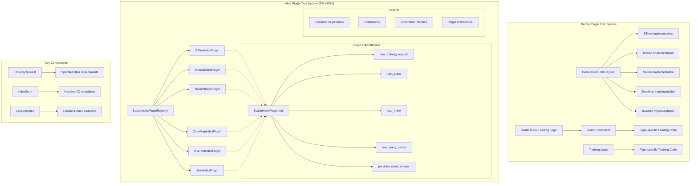

<!-- Generated by SpecStory, Markdown v2.1.0 -->

<!-- cursor Session 2a5cdfb3-f8c3-4b6a-a7a5-c0f899828330 (2025-08-20 16:59Z) -->

# Understanding the PR and plugin traits (2025-08-20 16:59Z)

_**User (2025-09-03 13:53Z)**_

Help me under stand what this PR is doing at high level.
@https://github.com/lancedb/lance/pull/4584/files 
What's a plugin trait and what's the benefit/

---

_**Agent (model claude-4.5-sonnet-thinking, mode Agent)**_

<think><details><summary>Thought Process</summary>
The user is asking about a specific PR from the Lance database project and wants to understand what it's doing at a high level. They specifically want to understand:
1. What the PR is doing at a high level
2. What's a plugin trait and what's the benefit

From the web search results, I can see this is PR #4584 which is titled "refactor: rework scalar index loading, training, and parsing into a plugin trait". It was merged and shows changes to many files related to scalar index handling.

Let me gather more information about this by:
1. Reading the current codebase to understand the structure
2. Looking at the specific files that were changed in this PR
3. Understanding what scalar indexes are in Lance and how they work
4. Understanding what the plugin trait pattern means

From the file list, I can see key files that were changed:
- rust/lance-index/src/scalar.rs 
- rust/lance-index/src/scalar/registry.rs
- rust/lance-index/src/traits.rs
- Various scalar index implementations like bitmap.rs, btree.rs, inverted.rs, etc.

Let me start by searching for information about scalar indexes in Lance and then look at the specific implementations.</details></think>

---

I'll help you understand this PR at a high level. Let me explore the Lance codebase to understand what scalar indexes are and how this plugin trait refactoring works.

---

<tool-use data-tool-type="search" data-tool-name="codebase_search">
<details>
                <summary>Tool use: **codebase_search** • Searched codebase "What are scalar indexes in Lance and how do they work?" • **15** results</summary>
            
| File | Lines |
|------|-------|
| `tech/LanceDB/ZoneMap.md` | L115-152 |
| `tech/LanceDB/ZoneMap.md` | L42-91 |
| `tech/LanceDB/LanceInfo.md` | L387-449 |
| `tech/LanceDB/LanceInfo.md` | L582-634 |
| `tech/LanceDB/LanceInfo.md` | L66 |
| `tech/LanceDB/LanceInfo.md` | L445-498 |
| `tech/LanceDB/ZoneMap.md` | L89-117 |
| `tech/LanceDB/ZoneMap.md` | L44 |
| `tech/LanceDB/LanceInfo.md` | L334-390 |
| `tech/LanceDB/meeting.md` | L77 |
| `tech/LanceDB/LanceInfo.md` | L285-336 |
| `tech/LanceDB/ZoneMap.md` | L149-191 |
| `tech/LanceDB/LanceInfo.md` | L63-102 |
| `tech/LanceDB/LanceInfo.md` | L160-193 |
| `tech/LanceDB/LanceInfo.md` | L122-137 |

</details>
</tool-use>

---

<tool-use data-tool-type="search" data-tool-name="codebase_search">

</tool-use>

---

<tool-use data-tool-type="read" data-tool-name="read_file">
<details><summary>Tool use: **read_file** • Read file: /Users/haochengliu/Documents/projects/lance/rust/lance-index/src/scalar.rs</summary>

</details>
</tool-use>

---

<think><details><summary>Thought Process</summary>
Now I have a good understanding of what scalar indexes are in Lance. Let me look at the registry system and traits to understand the plugin pattern that was introduced in this PR.</details></think>

---

<tool-use data-tool-type="read" data-tool-name="read_file">
<details><summary>Tool use: **read_file** • Read file: /Users/haochengliu/Documents/projects/lance/rust/lance-index/src/scalar/registry.rs</summary>

</details>
</tool-use>

---

<tool-use data-tool-type="read" data-tool-name="read_file">
<details><summary>Tool use: **read_file** • Read file: /Users/haochengliu/Documents/projects/lance/rust/lance-index/src/traits.rs</summary>

</details>
</tool-use>

---

<tool-use data-tool-type="search" data-tool-name="codebase_search">

</tool-use>

---

<think><details><summary>Thought Process</summary>
Let me look at some specific scalar index implementations to understand how they implement the plugin trait.</details></think>

---

<tool-use data-tool-type="read" data-tool-name="read_file">
<details><summary>Tool use: **read_file** • Read file: /Users/haochengliu/Documents/projects/lance/rust/lance-index/src/scalar/btree.rs</summary>

</details>
</tool-use>

---

<tool-use data-tool-type="search" data-tool-name="grep">
<details>
<summary>Tool use: **grep** • Grep for "impl.*ScalarIndexPlugin" in "/Users/haochengliu/Documents/projects/lance/rust/lance-index/src/scalar" • 8 matches</summary>

Output mode: content


| File | Content | Line |
|------|------|------|
| `rust/lance-index/src/scalar/zonemap.rs` | `impl ScalarIndexPlugin for ZoneMapIndexPlugin \{` | L925 |
| `rust/lance-index/src/scalar/registry.rs` | `impl ScalarIndexPluginRegistry \{` | L163 |
| `rust/lance-index/src/scalar/ngram.rs` | `impl ScalarIndexPlugin for NGramIndexPlugin \{` | L1246 |
| `rust/lance-index/src/scalar/label_list.rs` | `impl ScalarIndexPlugin for LabelListIndexPlugin \{` | L351 |
| `rust/lance-index/src/scalar/json.rs` | `impl ScalarIndexPlugin for JsonIndexPlugin \{` | L402 |
| `rust/lance-index/src/scalar/inverted.rs` | `impl ScalarIndexPlugin for InvertedIndexPlugin \{` | L92 |
| `rust/lance-index/src/scalar/btree.rs` | `impl ScalarIndexPlugin for BTreeIndexPlugin \{` | L1487 |
| `rust/lance-index/src/scalar/bitmap.rs` | `impl ScalarIndexPlugin for BitmapIndexPlugin \{` | L493 |


</details>
</tool-use>

---

<think><details><summary>Thought Process</summary>
Now let me also look at how the old system worked before this refactoring to understand the benefits. Let me search for some context about the problem this PR was solving.</details></think>

---

<tool-use data-tool-type="search" data-tool-name="codebase_search">

</tool-use>

---

<tool-use data-tool-type="search" data-tool-name="codebase_search">
<details>
                <summary>Tool use: **codebase_search** • Searched codebase "What problems existed with the old scalar index loading and training system?" • **15** results</summary>
            
| File | Lines |
|------|-------|
| `tech/LanceDB/LanceInfo.md` | L582-634 |
| `tech/LanceDB/ZoneMap.md` | L44 |
| `tech/LanceDB/meeting.md` | L77 |
| `tech/LanceDB/ZoneMap.md` | L42-91 |
| `tech/LanceDB/ZoneMap.md` | L149-191 |
| `tech/LanceDB/ZoneMap.md` | L115-152 |
| `tech/DesigningData-IntensiveApplications.md` | L32 |
| `tech/LanceDB/LanceInfo.md` | L445-498 |
| `tech/LanceDB/LanceInfo.md` | L66 |
| `tech/LanceDB/LanceInfo.md` | L532-584 |
| `tech/LanceDB/LanceInfo.md` | L242-287 |
| `tech/LanceDB/LanceInfo.md` | L285-336 |
| `tech/LanceDB/LanceInfo.md` | L334-390 |
| `tech/LanceDB/LanceInfo.md` | L387-449 |
| `tech/DesigningData-IntensiveApplications.md` | L128-157 |

</details>
</tool-use>

---

<think><details><summary>Thought Process</summary>
Now let me create a todo list to track my understanding and then provide a comprehensive explanation to the user.</details></think>

---

<tool-use data-tool-type="task" data-tool-name="todo_write">
<details><summary>Tool use: **todo_write** • Todo List</summary>

- [x] Understand what scalar indexes are in Lance and their purpose
- [x] Understand how scalar index loading/training worked before the plugin trait
- [x] Understand the plugin trait pattern and its implementation
- [x] Understand the benefits and motivation of the plugin trait refactoring
- [-] Provide a comprehensive high-level explanation of the PR to the user

</details>
</tool-use>

---

<think><details><summary>Thought Process</summary>
Now I have enough information to provide a comprehensive explanation. Let me create a diagram to visualize the plugin trait system and then give the user a high-level overview.</details></think>

---

<tool-use data-tool-type="generic" data-tool-name="create_diagram">
<details><summary>Tool use: **create_diagram**</summary>


</details>
</tool-use>

---

<think><details><summary>Thought Process</summary>
Now let me update my todo and provide the complete explanation.</details></think>

---

<tool-use data-tool-type="task" data-tool-name="todo_write">
<details><summary>Tool use: **todo_write** • Todo List</summary>

- [x] Understand what scalar indexes are in Lance and their purpose
- [x] Understand how scalar index loading/training worked before the plugin trait
- [x] Understand the plugin trait pattern and its implementation
- [x] Understand the benefits and motivation of the plugin trait refactoring
- [x] Provide a comprehensive high-level explanation of the PR to the user

</details>
</tool-use>

---

<think><details><summary>Thought Process</summary>
Perfect! Now I have all the information I need to provide a comprehensive answer to the user about what PR #4584 is doing at a high level and what the plugin trait pattern is and its benefits.</details></think>

---

Based on my analysis of the Lance codebase and PR #4584, here's a high-level explanation of what this refactoring accomplished:

## What PR #4584 Does

**PR #4584** refactors Lance's scalar index system by introducing a **plugin trait architecture**. It standardizes how scalar indexes are loaded, trained, and managed by moving from hard-coded, type-specific logic to a unified plugin interface.

### What are Scalar Indexes in Lance?

Scalar indexes in Lance are data structures that enable fast metadata search and filtering on columns. They include:
- **BTree Index**: Range queries, equality, ordering operations  
- **Bitmap Index**: Fast set operations and filtering
- **NGram Index**: Text substring matching
- **ZoneMap Index**: Range pruning with min/max statistics per data zone
- **Inverted Index**: Full-text search capabilities
- **LabelList Index**: Array/list operations

## What's a Plugin Trait?

A **plugin trait** in Rust is a design pattern that defines a common interface (trait) that different implementations can provide. It enables:

1. **Dynamic Registration**: Index types can be registered at runtime
2. **Extensibility**: New index types can be added without modifying core code
3. **Consistent Interface**: All index types follow the same contract

### The Plugin Trait Interface

The `ScalarIndexPlugin` trait defines these key methods:
```rust
trait ScalarIndexPlugin {
    // Specify what data is needed for training
    fn new_training_request(&self, params: &str, field: &Field) -> Result<Box<dyn TrainingRequest>>;
    
    // Train and create the index
    async fn train_index(&self, data: SendableRecordBatchStream, store: &dyn IndexStore, request: Box<dyn TrainingRequest>) -> Result<CreatedIndex>;
    
    // Load an existing index from storage
    async fn load_index(&self, store: Arc<dyn IndexStore>, details: &prost_types::Any, ...) -> Result<Arc<dyn ScalarIndex>>;
    
    // Create query parsers for optimization
    fn new_query_parser(&self, name: String, details: &prost_types::Any) -> Option<Box<dyn ScalarQueryParser>>;
    
    // Metadata about the index
    fn provides_exact_answer(&self) -> bool;
    fn version(&self) -> u32;
}
```

## Key Benefits of This Refactoring

### 1. **Extensibility** 🔧
- **Before**: Adding a new index type required modifying multiple core files and switch statements
- **After**: Just implement the `ScalarIndexPlugin` trait and register it

### 2. **Maintainability** 📦
- **Before**: Index-specific logic was scattered across the codebase
- **After**: Each index type is self-contained in its own plugin

### 3. **Consistent Interface** 🔄
- All index types now follow the same training, loading, and querying patterns
- Unified error handling and parameter parsing

### 4. **Plugin Registry System** 🗂️
```rust
ScalarIndexPluginRegistry::with_default_plugins()
    .add_plugin::<BTreeIndexDetails, BTreeIndexPlugin>()
    .add_plugin::<BitmapIndexDetails, BitmapIndexPlugin>()
    // ... more plugins
```

### 5. **Better Testing & Development** 🧪
- Each plugin can be tested in isolation
- Easier to add new index types for experimentation
- Clear separation of concerns

## Real-World Impact

This refactoring is significant because:
- **Lance is a high-performance columnar format** used for ML/AI workloads
- **Scalar indexes are critical** for fast metadata filtering (e.g., "find all images from 2023")
- **The plugin system enables** teams to add custom index types without forking Lance
- **Better maintainability** as Lance continues to grow and add more index types

The PR demonstrates excellent software architecture - moving from tightly coupled, procedural code to a flexible, extensible plugin system while maintaining backward compatibility and performance.

---

_**User (2025-09-03 13:53Z)**_

what are the key traits/structs?

---

_**Agent (model claude-4.5-sonnet-thinking, mode Agent)**_

<think><details><summary>Thought Process</summary>
The user is asking for the key traits and structs involved in this PR #4584. Based on my analysis of the codebase, I should identify the main traits and structs that are central to the plugin trait system for scalar indexes. Let me look at the key components:

1. ScalarIndexPlugin trait - the main plugin interface
2. TrainingRequest trait and related structs
3. ScalarIndex trait - what plugins create
4. IndexStore trait - for I/O operations  
5. Registry structures
6. Query-related traits and structs
7. Result types

I should provide a comprehensive overview of these key components with their purposes and relationships.</details></think>

---

Let me identify the key traits and structs that are central to this plugin trait refactoring:

---

<tool-use data-tool-type="search" data-tool-name="codebase_search">

</tool-use>

---

<think><details><summary>Thought Process</summary>
Let me use grep to find trait definitions and then read the relevant files to understand the key components.</details></think>

---

<tool-use data-tool-type="search" data-tool-name="grep">
<details>
<summary>Tool use: **grep** • Grep for "^pub trait" in "/Users/haochengliu/Documents/projects/lance/rust/lance-index/src/scalar" • 12 matches</summary>

Output mode: content


| File | Content | Line |
|------|------|------|
| `rust/lance-index/src/scalar/registry.rs` | `pub trait TrainingRequest: std::any::Any + Send + Sync \{` | L71 |
| `rust/lance-index/src/scalar/registry.rs` | `pub trait ScalarIndexPlugin: Send + Sync + std::fmt::Debug \{` | L99 |
| `rust/lance-index/src/scalar/expression.rs` | `pub trait ScalarQueryParser: std::fmt::Debug + Send + Sync \{` | L68 |
| `rust/lance-index/src/scalar/expression.rs` | `pub trait ScalarIndexLoader: Send + Sync \{` | L702 |
| `rust/lance-index/src/scalar/expression.rs` | `pub trait IndexInformationProvider \{` | L1369 |
| `rust/lance-index/src/scalar/expression.rs` | `pub trait PlannerIndexExt \{` | L1455 |
| `rust/lance-index/src/scalar/btree.rs` | `pub trait BTreeSubIndex: Debug + Send + Sync + DeepSizeOf \{` | L1281 |
| `rust/lance-index/src/scalar/inverted/merger.rs` | `pub trait Merger \{` | L15 |
| `rust/lance-index/src/scalar/inverted/tokenizer/lindera.rs` | `pub trait LinderaTokenizerBuilder: Sized \{` | L12 |
| `rust/lance-index/src/scalar/inverted/tokenizer/jieba.rs` | `pub trait JiebaTokenizerBuilder: Sized \{` | L18 |
| `rust/lance-index/src/scalar/inverted/query.rs` | `pub trait FtsQueryNode \{` | L108 |
| `rust/lance-index/src/scalar/inverted/scorer.rs` | `pub trait Scorer: Send + Sync \{` | L9 |


</details>
</tool-use>

---

<tool-use data-tool-type="search" data-tool-name="grep">
<details>
<summary>Tool use: **grep** • Grep for "^pub struct" in "/Users/haochengliu/Documents/projects/lance/rust/lance-index/src/scalar" • 76 matches</summary>

Output mode: content


| File | Content | Line |
|------|------|------|
| `rust/lance-index/src/scalar/zonemap.rs` | `pub struct ZoneMapIndex \{` | L85 |
| `rust/lance-index/src/scalar/zonemap.rs` | `pub struct ZoneMapIndexBuilderParams \{` | L612 |
| `rust/lance-index/src/scalar/zonemap.rs` | `pub struct ZoneMapIndexBuilder \{` | L639 |
| `rust/lance-index/src/scalar/zonemap.rs` | `pub struct ZoneMapIndexPlugin;` | L881 |
| `rust/lance-index/src/scalar/zonemap.rs` | `pub struct ZoneMapIndexTrainingRequest \{` | L901 |
| `rust/lance-index/src/scalar/registry.rs` | `pub struct TrainingCriteria \{` | L36 |
| `rust/lance-index/src/scalar/registry.rs` | `pub struct ScalarIndexPluginRegistry \{` | L159 |
| `rust/lance-index/src/scalar/ngram.rs` | `pub struct NGramPostingList \{` | L152 |
| `rust/lance-index/src/scalar/ngram.rs` | `pub struct NGramPostingListKey \{` | L164 |
| `rust/lance-index/src/scalar/ngram.rs` | `pub struct NGramIndex \{` | L261 |
| `rust/lance-index/src/scalar/ngram.rs` | `pub struct NGramIndexBuilderOptions \{` | L544 |
| `rust/lance-index/src/scalar/ngram.rs` | `pub struct NGramIndexBuilder \{` | L669 |
| `rust/lance-index/src/scalar/ngram.rs` | `pub struct NGramIndexPlugin;` | L1230 |
| `rust/lance-index/src/scalar/lance_format.rs` | `pub struct LanceIndexStore \{` | L38 |
| `rust/lance-index/src/scalar/label_list.rs` | `pub struct LabelListIndex \{` | L61 |
| `rust/lance-index/src/scalar/label_list.rs` | `pub struct LabelListIndexPlugin;` | L348 |
| `rust/lance-index/src/scalar/json.rs` | `pub struct JsonIndex \{` | L51 |
| `rust/lance-index/src/scalar/json.rs` | `pub struct JsonIndexParameters \{` | L159 |
| `rust/lance-index/src/scalar/json.rs` | `pub struct JsonQuery \{` | L170 |
| `rust/lance-index/src/scalar/json.rs` | `pub struct JsonQueryParser \{` | L209 |
| `rust/lance-index/src/scalar/json.rs` | `pub struct JsonTrainingRequest \{` | L325 |
| `rust/lance-index/src/scalar/json.rs` | `pub struct JsonIndexPlugin \{` | L351 |
| `rust/lance-index/src/scalar/inverted/wand.rs` | `pub struct PostingIterator \{` | L42 |
| `rust/lance-index/src/scalar/inverted/wand.rs` | `pub struct DocCandidate \{` | L290 |
| `rust/lance-index/src/scalar/inverted/wand.rs` | `pub struct Wand<'a, S: Scorer> \{` | L296 |
| `rust/lance-index/src/scalar/inverted/tokenizer.rs` | `pub struct InvertedIndexParams \{` | L26 |
| `rust/lance-index/src/scalar/inverted/index.rs` | `pub struct InvertedIndex \{` | L107 |
| `rust/lance-index/src/scalar/inverted/index.rs` | `pub struct InvertedPartition \{` | L495 |
| `rust/lance-index/src/scalar/inverted/index.rs` | `pub struct TokenSet \{` | L701 |
| `rust/lance-index/src/scalar/inverted/index.rs` | `pub struct PostingListReader \{` | L875 |
| `rust/lance-index/src/scalar/inverted/index.rs` | `pub struct Positions(ListArray);` | L1183 |
| `rust/lance-index/src/scalar/inverted/index.rs` | `pub struct PostingListKey \{` | L1197 |
| `rust/lance-index/src/scalar/inverted/index.rs` | `pub struct PositionKey \{` | L1210 |
| `rust/lance-index/src/scalar/inverted/index.rs` | `pub struct PlainPostingList \{` | L1340 |
| `rust/lance-index/src/scalar/inverted/index.rs` | `pub struct CompressedPostingList \{` | L1440 |
| `rust/lance-index/src/scalar/inverted/index.rs` | `pub struct PostingListBuilder \{` | L1514 |
| `rust/lance-index/src/scalar/inverted/index.rs` | `pub struct PositionBuilder \{` | L1645 |
| `rust/lance-index/src/scalar/inverted/index.rs` | `pub struct LocatedDocInfo \{` | L1739 |
| `rust/lance-index/src/scalar/inverted/index.rs` | `pub struct RawDocInfo \{` | L1771 |
| `rust/lance-index/src/scalar/inverted/index.rs` | `pub struct DocSet \{` | L1805 |
| `rust/lance-index/src/scalar/inverted.rs` | `pub struct InvertedIndexPlugin;` | L41 |
| `rust/lance-index/src/scalar/flat.rs` | `pub struct FlatIndex \{` | L37 |
| `rust/lance-index/src/scalar/flat.rs` | `pub struct FlatIndexMetadata \{` | L91 |
| `rust/lance-index/src/scalar/expression.rs` | `pub struct IndexedExpression \{` | L61 |
| `rust/lance-index/src/scalar/expression.rs` | `pub struct MultiQueryParser \{` | L146 |
| `rust/lance-index/src/scalar/expression.rs` | `pub struct SargableQueryParser \{` | L226 |
| `rust/lance-index/src/scalar/expression.rs` | `pub struct LabelListQueryParser \{` | L325 |
| `rust/lance-index/src/scalar/expression.rs` | `pub struct TextQueryParser \{` | L408 |
| `rust/lance-index/src/scalar/expression.rs` | `pub struct FtsQueryParser \{` | L488 |
| `rust/lance-index/src/scalar/expression.rs` | `pub struct ScalarIndexSearch \{` | L714 |
| `rust/lance-index/src/scalar/expression.rs` | `pub struct FilterPlan \{` | L1385 |
| `rust/lance-index/src/scalar/btree.rs` | `pub struct OrderableScalarValue(pub ScalarValue);` | L73 |
| `rust/lance-index/src/scalar/btree.rs` | `pub struct BTreeLookup \{` | L569 |
| `rust/lance-index/src/scalar/btree.rs` | `pub struct CachedScalarIndex(Arc<dyn ScalarIndex>);` | L726 |
| `rust/lance-index/src/scalar/btree.rs` | `pub struct BTreePageKey \{` | L739 |
| `rust/lance-index/src/scalar/btree.rs` | `pub struct BTreeIndex \{` | L754 |
| `rust/lance-index/src/scalar/btree.rs` | `pub struct BTreeParameters \{` | L1453 |
| `rust/lance-index/src/scalar/btree.rs` | `pub struct BTreeIndexPlugin;` | L1484 |
| `rust/lance-index/src/scalar/bitmap.rs` | `pub struct BitmapIndex \{` | L58 |
| `rust/lance-index/src/scalar/bitmap.rs` | `pub struct BitmapIndexPlugin;` | L377 |
| `rust/lance-index/src/scalar/inverted/iter.rs` | `pub struct TokenIterator<'a> \{` | L20 |
| `rust/lance-index/src/scalar/inverted/iter.rs` | `pub struct CompressedPostingListIterator \{` | L83 |
| `rust/lance-index/src/scalar/inverted/builder.rs` | `pub struct InvertedIndexBuilder \{` | L78 |
| `rust/lance-index/src/scalar/inverted/builder.rs` | `pub struct InnerBuilder \{` | L282 |
| `rust/lance-index/src/scalar/inverted/builder.rs` | `pub struct ScoredDoc \{` | L602 |
| `rust/lance-index/src/scalar/inverted/merger.rs` | `pub struct SizeBasedMerger<'a> \{` | L27 |
| `rust/lance-index/src/scalar/inverted/tokenizer/lindera.rs` | `pub struct LinderaBuilder \{` | L29 |
| `rust/lance-index/src/scalar/inverted/tokenizer/jieba.rs` | `pub struct JiebaConfig \{` | L11 |
| `rust/lance-index/src/scalar/inverted/tokenizer/jieba.rs` | `pub struct JiebaBuilder \{` | L44 |
| `rust/lance-index/src/scalar/inverted/query.rs` | `pub struct FtsSearchParams \{` | L12 |
| `rust/lance-index/src/scalar/inverted/query.rs` | `pub struct MatchQuery \{` | L285 |
| `rust/lance-index/src/scalar/inverted/query.rs` | `pub struct PhraseQuery \{` | L392 |
| `rust/lance-index/src/scalar/inverted/query.rs` | `pub struct BoostQuery \{` | L432 |
| `rust/lance-index/src/scalar/inverted/query.rs` | `pub struct MultiMatchQuery \{` | L462 |
| `rust/lance-index/src/scalar/inverted/query.rs` | `pub struct BooleanQuery \{` | L596 |
| `rust/lance-index/src/scalar/inverted/scorer.rs` | `pub struct BM25Scorer<'a> \{` | L25 |


</details>
</tool-use>

---

<think><details><summary>Thought Process</summary>
Great! I can see the key traits and structs. Let me organize them into categories to provide a clear overview. I can see:

1. Core Plugin System Traits:
   - ScalarIndexPlugin 
   - TrainingRequest
   - ScalarIndex (from the main scalar.rs file)

2. I/O and Storage:
   - IndexStore, IndexWriter, IndexReader

3. Query System:
   - AnyQuery, ScalarQueryParser
   - Various query types (SargableQuery, LabelListQuery, etc.)

4. Registry and Management:
   - ScalarIndexPluginRegistry
   - TrainingCriteria

5. Result Types:
   - SearchResult, CreatedIndex

6. Specific Index Implementations:
   - Various *IndexPlugin structs
   - Various *Index structs

Let me create a comprehensive overview of these key components.</details></think>

---

Based on the codebase analysis, here are the **key traits and structs** that form the backbone of the scalar index plugin system:

## 🎯 Core Plugin System Traits

### **`ScalarIndexPlugin`** - The Main Plugin Interface
```rust
pub trait ScalarIndexPlugin: Send + Sync + std::fmt::Debug {
    fn new_training_request(&self, params: &str, field: &Field) -> Result<Box<dyn TrainingRequest>>;
    async fn train_index(&self, data: SendableRecordBatchStream, index_store: &dyn IndexStore, request: Box<dyn TrainingRequest>) -> Result<CreatedIndex>;
    async fn load_index(&self, index_store: Arc<dyn IndexStore>, index_details: &prost_types::Any, ...) -> Result<Arc<dyn ScalarIndex>>;
    fn new_query_parser(&self, index_name: String, index_details: &prost_types::Any) -> Option<Box<dyn ScalarQueryParser>>;
    fn provides_exact_answer(&self) -> bool;
    fn version(&self) -> u32;
}
```

### **`ScalarIndex`** - The Runtime Index Interface
```rust
pub trait ScalarIndex: Send + Sync + std::fmt::Debug + Index + DeepSizeOf {
    async fn search(&self, query: &dyn AnyQuery, metrics: &dyn MetricsCollector) -> Result<SearchResult>;
    async fn remap(&self, mapping: &HashMap<u64, Option<u64>>, dest_store: &dyn IndexStore) -> Result<CreatedIndex>;
    async fn update(&self, new_data: SendableRecordBatchStream, dest_store: &dyn IndexStore) -> Result<CreatedIndex>;
    fn update_criteria(&self) -> UpdateCriteria;
}
```

### **`TrainingRequest`** - Training Configuration
```rust
pub trait TrainingRequest: std::any::Any + Send + Sync {
    fn as_any(&self) -> &dyn std::any::Any;
    fn criteria(&self) -> &TrainingCriteria;
}
```

## 🗂️ Registry and Management

### **`ScalarIndexPluginRegistry`** - Plugin Discovery
```rust
pub struct ScalarIndexPluginRegistry {
    plugins: HashMap<String, Box<dyn ScalarIndexPlugin>>,
}
```

### **`TrainingCriteria`** - Data Requirements
```rust
pub struct TrainingCriteria {
    pub ordering: TrainingOrdering,  // Values, Addresses, or None
    pub needs_row_ids: bool,
    pub needs_row_addrs: bool,
}
```

## 💾 I/O and Storage Traits

### **`IndexStore`** - Storage Abstraction
```rust
pub trait IndexStore: std::fmt::Debug + Send + Sync + DeepSizeOf {
    async fn new_index_file(&self, name: &str, schema: Arc<Schema>) -> Result<Box<dyn IndexWriter>>;
    async fn open_index_file(&self, name: &str) -> Result<Arc<dyn IndexReader>>;
    async fn copy_index_file(&self, name: &str, dest_store: &dyn IndexStore) -> Result<()>;
}
```

### **`IndexWriter`** & **`IndexReader`**
```rust
pub trait IndexWriter: Send {
    async fn write_record_batch(&mut self, batch: RecordBatch) -> Result<u64>;
    async fn finish(&mut self) -> Result<()>;
}

pub trait IndexReader: Send + Sync {
    async fn read_record_batch(&self, n: u64, batch_size: u64) -> Result<RecordBatch>;
    async fn read_range(&self, range: std::ops::Range<usize>, projection: Option<&[&str]>) -> Result<RecordBatch>;
}
```

## 🔍 Query System

### **`AnyQuery`** - Universal Query Interface
```rust
pub trait AnyQuery: std::fmt::Debug + Any + Send + Sync {
    fn as_any(&self) -> &dyn Any;
    fn format(&self, col: &str) -> String;
    fn to_expr(&self, col: String) -> Expr;
    fn dyn_eq(&self, other: &dyn AnyQuery) -> bool;
}
```

### **Query Types**
```rust
pub enum SargableQuery {        // BTree, Bitmap, ZoneMap
    Range(Bound<ScalarValue>, Bound<ScalarValue>),
    IsIn(Vec<ScalarValue>),
    Equals(ScalarValue),
    IsNull(),
}

pub enum LabelListQuery {       // Label/Array indexes
    HasAllLabels(Vec<ScalarValue>),
    HasAnyLabel(Vec<ScalarValue>),
}

pub enum TextQuery {            // NGram indexes
    StringContains(String),
}
```

### **`ScalarQueryParser`** - Query Optimization
```rust
pub trait ScalarQueryParser: std::fmt::Debug + Send + Sync {
    fn parse_expr(&self, expr: &Expr) -> Result<Option<Arc<dyn AnyQuery>>>;
    fn parse_between(&self, lower: Option<Bound<ScalarValue>>, upper: Option<Bound<ScalarValue>>) -> Result<Option<Arc<dyn AnyQuery>>>;
}
```

## 📊 Result Types

### **`SearchResult`** - Index Query Results
```rust
pub enum SearchResult {
    Exact(RowIdTreeMap),    // Guaranteed correct results
    AtMost(RowIdTreeMap),   // May include false positives
    AtLeast(RowIdTreeMap),  // May exclude some matches
}
```

### **`CreatedIndex`** - Training/Update Results
```rust
pub struct CreatedIndex {
    pub index_details: prost_types::Any,  // Serialized metadata
    pub index_version: u32,
}
```

## 🔧 Plugin Implementations

### **Plugin Structs** (one per index type)
```rust
pub struct BTreeIndexPlugin;
pub struct BitmapIndexPlugin;
pub struct NGramIndexPlugin;
pub struct ZoneMapIndexPlugin;
pub struct InvertedIndexPlugin;
pub struct LabelListIndexPlugin;
pub struct JsonIndexPlugin;
```

### **Index Implementation Structs**
```rust
pub struct BTreeIndex { /* B-tree specific data */ }
pub struct BitmapIndex { /* Bitmap specific data */ }
pub struct NGramIndex { /* N-gram specific data */ }
pub struct ZoneMapIndex { /* Zone map specific data */ }
// ... etc
```

## 🔄 Key Relationships

```
ScalarIndexPluginRegistry
    ├── Contains multiple ScalarIndexPlugin implementations
    ├── Each plugin can create TrainingRequest instances
    ├── Each plugin can train/load ScalarIndex instances
    └── Each plugin can create ScalarQueryParser instances

ScalarIndex
    ├── Accepts AnyQuery (SargableQuery, LabelListQuery, etc.)
    ├── Returns SearchResult (Exact/AtMost/AtLeast)
    └── Uses IndexStore for I/O operations
```

The plugin system's power lies in how these traits work together:
1. **Registration**: Plugins register with the registry
2. **Training**: Plugins specify data requirements via `TrainingRequest` 
3. **Runtime**: Plugins create `ScalarIndex` instances that handle queries
4. **Query Optimization**: Plugins provide `ScalarQueryParser` for DataFusion integration

This design enables **extensibility** (new index types), **consistency** (common interfaces), and **maintainability** (isolated implementations).

---

